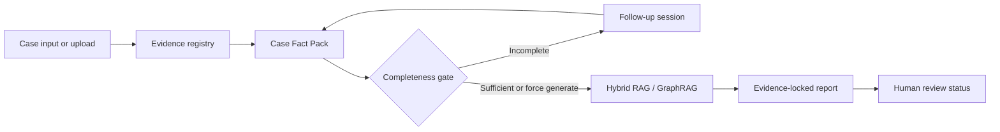

# CyberCase Intelligence Framework

CyberCase Intelligence Framework is an interactive web-based Retrieval-Augmented Generation (RAG) platform for cybercrime case analysis. It helps users submit incident details, identify missing investigative information, map technical evidence to cybersecurity knowledge such as MITRE ATT&CK, and generate structured investigation reports.

It features a modern Next.js frontend, a high-performance FastAPI backend, and a standalone RAG service that combines vector retrieval, graph-based MITRE ATT&CK knowledge, and LLM reasoning to provide grounded, evidence-based analysis.

## Project Structure

*   `Documents/`: Source reference documents and case-analysis knowledge assets.
*   `rag_service/`: Standalone RAG service with GraphRAG pipelines.
*   `backend/`: FastAPI application providing API endpoints, backed by PostgreSQL and SQLAlchemy. Calls `rag_service` for RAG capabilities.
*   `frontend/`: Next.js 15 web application with a modern dark-theme UI.

## Quick Start

### 1. Environment Setup

#### Python (for RAG and Backend)
Create a virtual environment to manage Python dependencies:
```bash
# In the project root directory
python -m venv env_mitre
```

Activate the virtual environment:
*   **Windows:** `.\env_mitre\Scripts\activate`
*   **macOS/Linux:** `source env_mitre/bin/activate`

Install the required Python packages:
```bash
# This script installs dependencies for both backend and rag_service
python install_deps.py
```

### 2. Environment Management (Doppler)
This project uses **Doppler** to manage environment variables securely. This replaces the need for manual `.env` files.

#### Login & Setup
If you haven't already, authenticate and select the project configuration:
```bash
doppler login
doppler setup
```

#### Running with Secrets
To run any command with environment variables injected:
```bash
doppler run -- <command>
```

### 3. Database Setup
You need a running PostgreSQL database. You can use the provided `docker-compose.yml`:
```bash
docker-compose up -d
```

### 4. RAG Service Setup (FastAPI)
```bash
cd rag_service/app
# Start the RAG service with Doppler secrets
doppler run -- uvicorn main:app --port 8001
```
The RAG service will be available at `http://localhost:8001`.

### 5. Backend Setup (FastAPI)
You don't need a `.env` file if you use Doppler.
```bash
cd backend
# Run migrations using Doppler secrets
doppler run -- alembic upgrade head

# Start the server with Doppler secrets
doppler run -- uvicorn app.main:app --reload
```
The backend will be available at `http://localhost:8000`.

### 6. Frontend Setup
Create a `.env.local` file in the `frontend/` directory.
```bash
cd frontend
npm install
npm run dev
```
The frontend will be available at `http://localhost:3000`.

### 7. RAG CLI Tools
You can also run the RAG pipelines directly via CLI for testing:
```bash
cd rag_service/app/RAG/GraphRAG
python main.py --test
```
*(Requires `ANTHROPIC_API_KEY` to be set in your environment for generation capabilities).*

## Documentation
*   `SKILL.md`: Technical overview and guidelines for AI agents working on the codebase.

## Evidence-Traceable Preliminary Legal Relevance Reports

The report workflow now builds an evidence registry and Case Fact Pack before generating a preliminary investigation report. The report is evidence-locked: facts, timeline items, MITRE mappings, and optional legal relevance must cite known evidence IDs such as `E-001`.



### Terminology

* `confirmed`: supported by submitted or retrieved evidence and treated as verified for the preliminary report.
* `reported`: provided by the user, uploaded content, logs, or OCR extraction but still requiring review.
* `inferred`: derived from retrieval or analysis and requiring investigator confirmation.
* `unknown`: missing or not supported by available evidence.

### Legal Mode

Legal relevance is disabled by default. When enabled, the system uses preliminary wording and includes this disclaimer:

> This is preliminary investigation support only and is not a legal conclusion.

The system must not determine guilt or innocence, claim court admissibility, make final legal conclusions, or invent laws, MITRE techniques, evidence, dates, or citations.

### Evidence IDs And Provenance Metadata

* User text and uploaded files are registered as evidence references such as `E-001`, `E-002`.
* Uploaded files include provenance metadata: original filename, content type, SHA-256 hash, upload timestamp, extraction method, and page number when available.
* This is evidence provenance metadata, not chain-of-custody compliance.
* Report validators reject unknown evidence IDs and MITRE technique IDs that were not present in retrieved MITRE data.

### Report API Summary

* `POST /api/v1/rag/generate-report`: start report analysis from text.
* `POST /api/v1/rag/generate-report-file`: start report analysis from an uploaded PDF/image with OCR provenance.
* `POST /api/v1/rag/resume-report`: resume report generation after a follow-up question.
* `GET /api/v1/rag/reports/{report_id}`: retrieve a generated report and Case Fact Pack.
* `PATCH /api/v1/rag/reports/{report_id}/review-status`: update `draft`, `ai_generated`, `reviewed`, or `approved` status.

### Migrations And Tests

This MVP stores generated report/review state in the RAG service in-memory store, so it does not add persisted SQLAlchemy models or an Alembic migration. If persistence is added later, create and apply a migration with:

```bash
cd backend
alembic revision --autogenerate -m "add report persistence"
alembic upgrade head
```

Run focused checks with:

```bash
cd backend && pytest
cd frontend && npm run lint
cd frontend && npm run build
```
