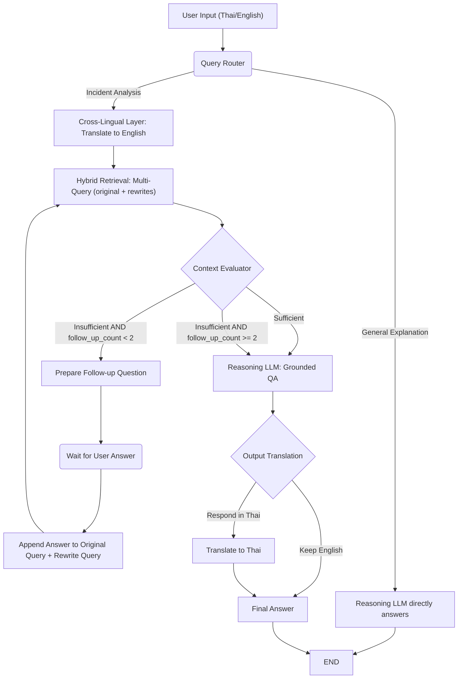

# CyberCase Intelligence Framework: Agentic RAG Pipeline

This document details the end-to-end process of the **LangGraph Agentic RAG Pipeline**, built to interpret cybersecurity incidents using the MITRE ATT&CK knowledge base. The system features a cross-lingual architecture, hybrid (Vector + Graph) retrieval, and a self-reflective agentic loop that asks targeted follow-up questions to progressively enrich retrieval.

---

## High-Level Workflow

The RAG pipeline operates as a stateful graph (implemented via LangGraph). The execution flow follows these primary stages:

---

## 1. Input & Routing (`router.py`)

When a user submits a query, it is first evaluated by the **QueryRouter**.
* **GENERAL_EXPLANATION**: If the query asks for definitions or concepts (e.g., "What is SQL Injection?"), it bypasses retrieval and routes directly to the LLM to answer using general knowledge.
* **INCIDENT_ANALYSIS**: If the query describes an attack sequence, forensic log, or incident, it routes into the main RAG retrieval pipeline.

## 2. Cross-Lingual Translation (`cross_lingual.py`)

To ensure maximum accuracy against the English-based MITRE ATT&CK database, the **CrossLingualLayer** translates the user's query into English.
* It explicitly preserves all technical identifiers (e.g., T1566, APT29, Phishing).
* If the user asks the query in English initially, this step is skipped.
* The system notes the original language so it can translate the final output back to the user's preferred language at the very end.

## 3. Hybrid Retrieval (`hybrid_retriever.py`)

Retrieval is performed against **all accumulated queries** (original query + all rewrites derived from follow-up answers) simultaneously, merging and deduplicating results.

1. **Vector Search**: Each query is embedded using BGE-M3 (a hybrid dense/sparse embedding model) and used to query Qdrant independently.
2. **Graph Expansion**: The system extracts STIX IDs from all vector matches and queries a Neo4j Graph Database. It retrieves subgraphs up to 2 hops away, pulling in related Mitigations, Sub-techniques, and Threat Actors.
3. **Context Assembly**: The `context_builder.py` merges and deduplicates all retrieved documents from every query, then formats them into a single structured context string for the LLM.

## 4. Context Evaluation & Follow-up Loop (`evaluator.py`)

Instead of blindly passing retrieved context to an LLM, the **ContextEvaluator** acts as a self-reflective judge. It inspects the merged context against the user's query and returns one of two verdicts:

* **SUFFICIENT**: The context contains enough information. Proceeds to answer generation immediately.
* **INSUFFICIENT**: The context does not fully address the query. The agent takes the following steps:
  1. **Ask a Follow-up Question**: The agent generates exactly **ONE targeted follow-up question** in the user's original language and pauses to wait for the user's answer.
  2. **Enrich & Rewrite**: Once the user replies, the answer is **appended to the original query** to form an enriched query. A rewritten query is also derived by reformulating with the new context. Both the original query and all new rewrites are retained.
  3. **Multi-Query Retrieval**: The next retrieval pass runs **all accumulated queries in parallel**, broadening coverage with each iteration.

> [!IMPORTANT]
> **Maximum Follow-up Iterations: 2**
> The pipeline tracks a `follow_up_count` counter. After **2** follow-up rounds, the evaluator is bypassed and the pipeline forces a `SUFFICIENT` verdict — the Reasoning LLM generates the best possible answer from all context accumulated so far.

### State tracked per pipeline run

| Field | Description |
|---|---|
| `original_query` | The initial translated English query (never mutated) |
| `rewritten_queries` | List of all rewritten queries derived from follow-up answers |
| `follow_up_count` | Number of follow-up questions asked so far (max: **2**) |
| `enriched_context` | Concatenation of all user follow-up answers |
| `merged_context` | Combined, deduplicated retrieval results across all queries |

## 5. Reasoning Generation (`context_builder.py` & `agent_graph.py`)

Once the context is deemed sufficient (or the follow-up limit is reached), the **Reasoning LLM** generates the answer.
* It uses a strict retrieval-grounded prompt, answering **only** from the provided merged context.
* It operates strictly in English, focusing on simplifying complex cybersecurity jargon into an easy-to-understand incident narrative while preserving ATT&CK IDs and technical terms.

## 6. Output Translation (`cross_lingual.py`)

If the user originally asked their question in Thai, the final English narrative is passed to a **Translation LLM**.
* This model renders the final output into natural Thai.
* It enforces a strict rule to never translate technical terms, CVEs, or ATT&CK IDs, ensuring the final forensic report is accurate and actionable for prosecutors.

