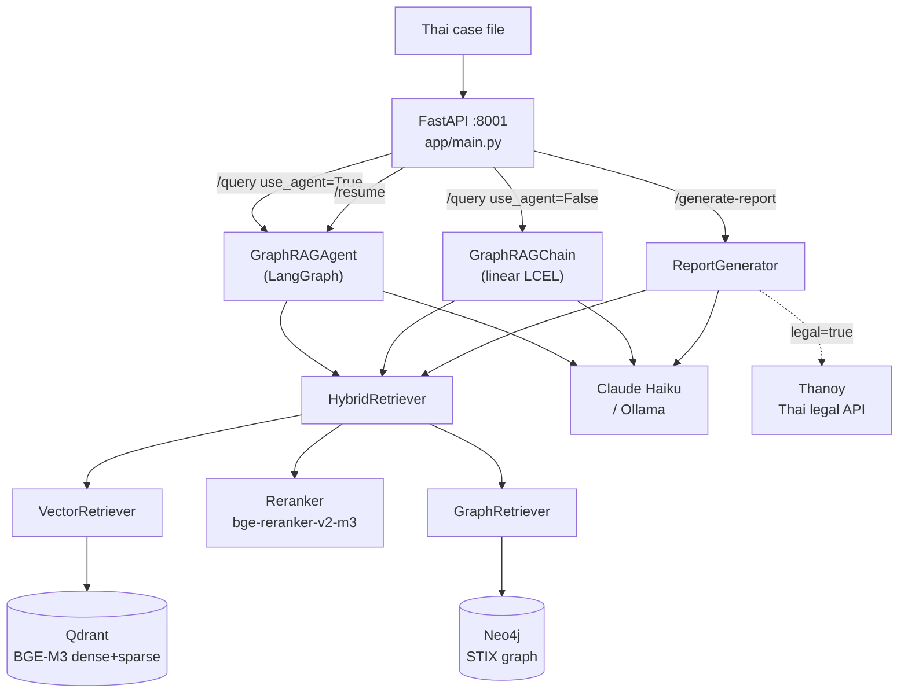
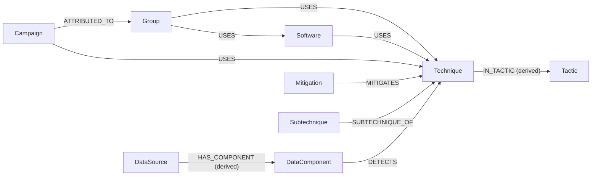
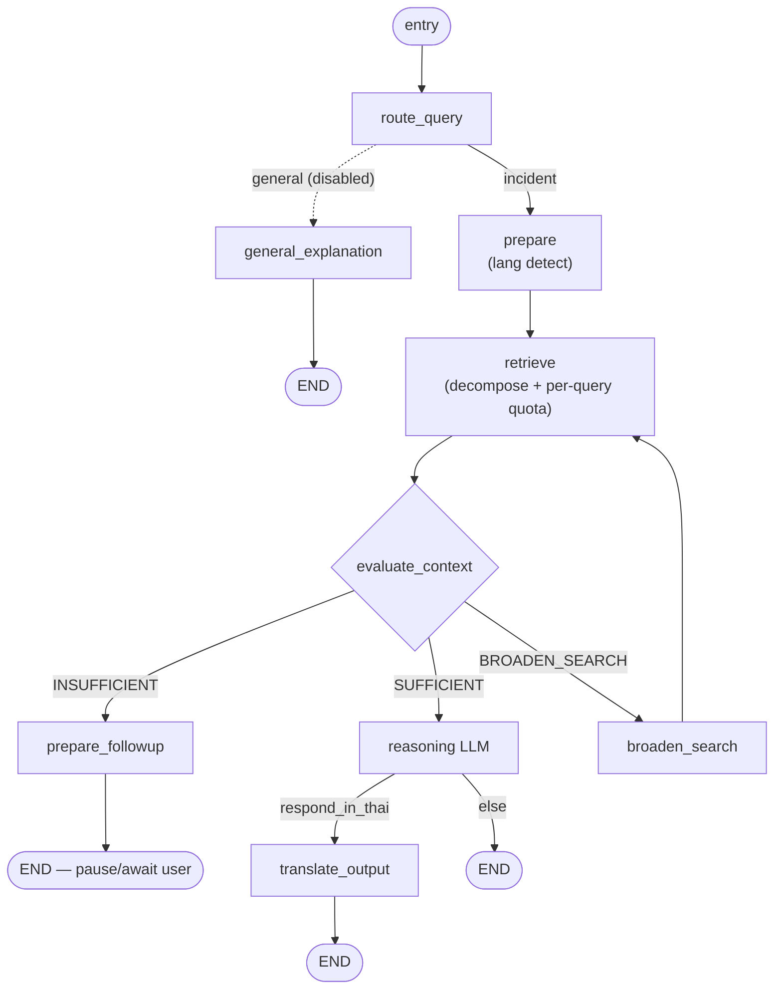
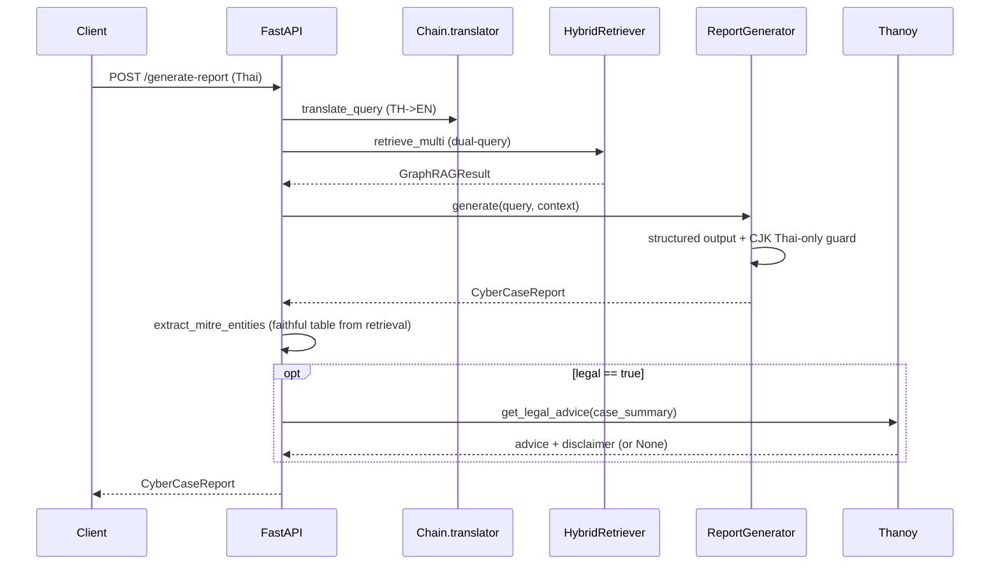

# CyberCase RAG Service — สถาปัตยกรรม & คู่มืออ้างอิงโค้ดทุกฟังก์ชัน

> เอกสารนี้เขียนขึ้นใหม่ทั้งหมดจากการอ่านซอร์สโค้ด `rag_service/` ทุกไฟล์ (ไม่อ้างอิงเอกสารเดิม)
> ครอบคลุม: ภาพรวมสถาปัตยกรรม, เทคนิค/method, DB schema, โมเดลทุกตัวใน pipeline,
> และคำอธิบาย **ทุกฟังก์ชัน/คลาส** แยกตามไฟล์
>
> ขอบเขต: `rag_service/app/RAG/GraphRAG` (pipeline RAG หลัก), `rag_service/app` (FastAPI + CLI + utilities),
> `rag_service/docs`, และ `rag_service/finetune` (โมดูล fine-tune MITRE specialist)

---

## สารบัญ

1. [ภาพรวมสถาปัตยกรรม](#1-ภาพรวมสถาปัตยกรรม)
2. [เทคนิค/Method ที่ใช้](#2-เทคนิคmethod-ที่ใช้)
3. [โมเดลทุกตัวใน Pipeline](#3-โมเดลทุกตัวใน-pipeline)
4. [DB Schema (Neo4j + Qdrant)](#4-db-schema)
5. [โครงสร้างไดเรกทอรี](#5-โครงสร้างไดเรกทอรี)
6. [Request Lifecycle](#6-request-lifecycle)
7. [อ้างอิงโค้ดทุกฟังก์ชัน](#7-อ้างอิงโค้ดทุกฟังก์ชัน)
   - [7.1 app/main.py](#71-appmainpy--fastapi-service)
   - [7.2 config.py](#72-configpy)
   - [7.3 models.py](#73-modelspy)
   - [7.4 pipeline/](#74-pipeline)
   - [7.5 retrieval/](#75-retrieval)
   - [7.6 ingestion/](#76-ingestion)
   - [7.7 evaluation/](#77-evaluation)
   - [7.8 CLI & utilities](#78-cli--utilities)
   - [7.9 finetune/](#79-finetune)

---

## 1. ภาพรวมสถาปัตยกรรม

`rag_service` เป็น **FastAPI microservice (พอร์ต 8001)** ที่โฮสต์ GraphRAG pipeline ทั้งหมด
Backend gateway (พอร์ต 8000) เป็นเพียง proxy ที่เรียกบริการนี้ผ่าน HTTP ส่วน RAG ทั้งหมดอยู่ที่นี่

```
                       ┌──────────────────────────────────────────────┐
   Thai case file ───▶ │  FastAPI (app/main.py, :8001)                 │
                       │  /query  /resume  /generate-report  /health   │
                       └───────────────┬──────────────────────────────┘
                                       │ (โหลดโมเดล + เชื่อม DB ครั้งเดียวตอน startup)
          ┌────────────────────────────┼─────────────────────────────────┐
          ▼                            ▼                                  ▼
   GraphRAGAgent              HybridRetriever                       ReportGenerator
   (LangGraph state machine)  ├─ VectorRetriever ─▶ Qdrant (BGE-M3 dense+sparse)
   route→prepare→retrieve     ├─ Reranker (bge-reranker-v2-m3)
   →evaluate→(followup|        └─ GraphRetriever ─▶ Neo4j (STIX graph, 1-hop expand)
     broaden|reason)
   →translate→END
```



**3 เส้นทางหลักของบริการ**

| Endpoint | คลาสที่ใช้ | เส้นทาง |
|---|---|---|
| `POST /query` (`use_agent=True`) | `GraphRAGAgent` | agentic LangGraph: decompose → quota-retrieve → evaluate → (follow-up/broaden) → reason → translate |
| `POST /query` (`use_agent=False`) | `GraphRAGChain` | linear LCEL: translate → dual-query retrieve → reason → translate |
| `POST /resume` | `GraphRAGAgent.resume` | ดำเนิน session ที่ pause เพื่อถาม follow-up ต่อ |
| `POST /generate-report` | `HybridRetriever` + `ReportGenerator` (+`thanoy_client`) | รายงานคดี 3 ส่วน: case summary + faithful MITRE table + (optional) Thai legal |

**สอง pipeline ที่ขนานกันในโค้ด**
- `GraphRAGAgent` (`pipeline/agent_graph.py`) — เส้นทาง production agentic ใหม่ (decomposer + quota + self-reflection + follow-up)
- `GraphRAGChain` (`pipeline/chain.py`) — เส้นทาง linear เดิม (ยังใช้ใน `/generate-report` เพื่อแปล query และใน eval generation)

---

## 2. เทคนิค/Method ที่ใช้

| เทคนิค | ที่อยู่ | สาระสำคัญ |
|---|---|---|
| **GraphRAG** | `retrieval/hybrid_retriever.py` | รวม Vector search + Graph expansion: ดึง top-K จาก Qdrant แล้วขยาย subgraph จาก Neo4j ตาม stix_id |
| **Hybrid Vector Search (Dense + Sparse)** | `vector_retriever.py` | BGE-M3 ให้ทั้ง dense (1024-d) และ sparse (lexical) → Qdrant native RRF fusion ในเครื่อง query เดียว |
| **RRF (Reciprocal Rank Fusion)** | Qdrant `FusionQuery(Fusion.RRF)` + config `RRF_K=60` | รวมผล dense/sparse และผลข้าม collection |
| **Cross-encoder Reranking** | `retrieval/reranker.py` | `bge-reranker-v2-m3` ให้คะแนน (query, doc) ใหม่ → sigmoid → top-K ก่อนป้อน graph + LLM |
| **Node-type re-weighting** | `hybrid_retriever._reweight_by_type` | คูณคะแนน Technique/Subtechnique/Tactic ขึ้น, Group/Software/Campaign ลง → technique ลอยขึ้น |
| **Cross-lingual retrieval** | `pipeline/cross_lingual.py` | input ไทยเสมอ, output ไทยเสมอ; แปลอังกฤษเป็น internal-only |
| **Dual-query (chain/report path)** | `build_retrieval_queries` | ดึงทั้ง query อังกฤษที่แปล + query ไทยต้นฉบับขนานกัน กัน mistranslation ทำ retrieval พัง |
| **Query Decomposition (agent path)** | `pipeline/query_decomposer.py` | แตก incident เป็น sub-query atomic ต่อ technique (ภาษาเดิม, ไม่แปล — BGE-M3 multilingual) |
| **Per-query Quota Retrieval** | `hybrid_retriever.retrieve_multi_quota` | เก็บ top-`per_query_k` ของแต่ละ sub-query แล้ว round-robin interleave → ทุก technique ได้พื้นที่ |
| **Self-reflection / Self-RAG loop** | `pipeline/evaluator.py` + agent edges | LLM ประเมิน context พอหรือไม่ → SUFFICIENT / INSUFFICIENT(ถาม follow-up) / BROADEN_SEARCH |
| **Slot-aware Follow-up** | `evaluator.py` + `agent_graph._resume_with_answer` | ถามทีละ slot (initial_access → credential_theft → priv_esc → lateral → impact) ไม่ถามซ้ำ |
| **Query Merger** | `pipeline/query_merger.py` | รวม query เดิม + คำตอบ follow-up เป็น query เดียวที่ MITRE-aligned |
| **3-stage cross-lingual generation** | `cross_lingual` prompts | (1) translate query → EN, (2) reasoning LLM → simplified EN, (3) translation LLM → Thai |
| **Faithful MITRE table** | `report_generator.extract_mitre_entities` | สร้างตารางจาก entity ที่ retrieve จริง (ไม่ใช่จาก LLM) → ID ไม่ถูก hallucinate |
| **CJK Thai-only guard** | `report_generator._sanitize_thai` | ตรวจ token จีน/ญี่ปุ่น/เกาหลีหลุดในรายงาน → re-translate field เป็นไทยล้วน |
| **Domain filter (mobile กันปน)** | `vector_retriever.search_entities` + `config.ATTACK_DOMAIN_FILTER` | กรอง entity ให้เหลือ domain enterprise หลัง retrieval |
| **Agentic state machine** | `pipeline/agent_graph.py` (LangGraph) | StateGraph: node + conditional edges + in-memory session store สำหรับ pause/resume |
| **Thai legal delegation** | `pipeline/thanoy_client.py` | ไม่สอนกฎหมายไทยให้ MITRE model (กัน hallucinate มาตรา) → เรียก Thanoy API แทน |
| **Eval: retriever metrics** | `evaluation/retriever_metrics.py` | Hit@K, Recall@K, Precision@K, MRR, NDCG@K, MAP |
| **Eval: generation metrics** | `evaluation/generation_metrics.py` | RAGAS (faithfulness, answer_correctness) + fallback Token-F1/ROUGE-L/BERTScore |
| **Graph-grounded eval dataset** | `evaluation/generate_eval_dataset.py` | สร้าง ground-truth จาก Cypher (กราฟ = ground truth) → ไม่ label มือ |
| **MITRE specialist fine-tune** | `finetune/` | QLoRA/16-bit LoRA บน Qwen, dataset จาก STIX, A/B เทียบ base vs fine-tune ผ่าน env-swap |

---

## 3. โมเดลทุกตัวใน Pipeline

| บทบาท | โมเดล (cloud) | โมเดล (local `--local`) | ตั้งค่าที่ |
|---|---|---|---|
| **Embedding** | `BAAI/bge-m3` (1024-d, FP16, dense+sparse) | (เหมือนกัน) | `EMBED_MODEL`, `USE_FP16` |
| **Reranker** | `BAAI/bge-reranker-v2-m3` (cross-encoder, รองรับไทย) | (เหมือนกัน) | `RERANKER_MODEL` |
| **Reasoning / Translation / Router / Decomposer LLM** | `claude-haiku-4-5` | `qwen2.5:7b` (Ollama) | `LLM_MODEL` / `LOCAL_LLM_MODEL` |
| **Evaluator / Query-merger LLM** | `claude-haiku-4-5` | `gemma3:4b` (Ollama) | `EVALUATOR_LLM_MODEL` / `LOCAL_EVAL_MODEL` |
| **RAGAS judge (eval)** | Claude Haiku → OpenRouter `qwen/qwen-2.5-72b-instruct` | `gemma3:4b` | `RAGAS_LLM_MODEL`, `OPENROUTER_*` |
| **RAGAS embeddings (eval)** | `nomic-embed-text` (Ollama, local) | (เหมือนกัน) | hard-coded ใน `generation_metrics` |
| **Thai legal AI** | Thanoy (iApp REST API) | (เหมือนกัน) | `THANOY_API_*` |
| **Fine-tune target** | — | `Qwen/Qwen3.5-4B` → `mitre-qwen3.5:4b` (16-bit LoRA) | `finetune/ft_config.py` |

> หมายเหตุ: master switch `USE_LOCAL` (env) สลับทั้ง pipeline ไป Ollama; CLI ใช้ flag `--local` (eval/finetune)
> `download_model.py` (ใช้ตอน build Docker) ยัง pre-cache reranker ตัวเก่า `cross-encoder/mmarco-mMiniLMv2-L12-H384-v1`

**Tech stack** (จาก `requirements.txt`): FastAPI + Uvicorn, Pydantic v2, `neo4j`, `qdrant-client`, `FlagEmbedding` (BGE-M3), `sentence-transformers` (reranker), LangChain (`langchain-anthropic`, `langchain-ollama`, `langgraph`), `anthropic`, `httpx`, `stix2`, RAGAS/datasets/bert-score/rouge-score (eval), torch/transformers.
**Deploy**: `Dockerfile` (python:3.11-slim) ติดตั้ง torch CPU, pre-cache embedding model, รัน `uvicorn app.main:app --port 8001`. Neo4j + Qdrant เป็น cloud-hosted

---

## 4. DB Schema

### 4.1 Neo4j (Graph DB) — STIX entities + relationships

**Node labels** (ทุก node ได้ base label `:Entity` เพิ่มด้วย เพื่อ match เร็วตอนสร้าง edge):

`Technique`, `Subtechnique`, `Group`, `Software`, `Campaign`, `Mitigation`, `Tactic`, `DataSource`, `DataComponent`

**Node properties** (จาก `graph_loader._entity_to_props`):
- ทุก node: `stix_id` (unique), `attack_id`, `name`, `description` (≤5000 ตัวอักษร), `url`, `domain` (`enterprise`/`mobile`/`ics`)
- `Technique`/`Subtechnique`: `platforms`, `is_subtechnique`
- `Software`: `software_type` (`tool`/`malware`), `aliases`
- `Tactic`: `shortname` (เช่น `initial-access`)
- `Group`/`Campaign`: `aliases`

**Edge types** (จาก `RELATIONSHIP_TYPE_MAP` + derived edges):

| Edge | จาก → ไป | ที่มา |
|---|---|---|
| `USES` | Group/Software/Campaign → Technique/Software | STIX `uses` |
| `MITIGATES` | Mitigation → Technique | STIX `mitigates` |
| `SUBTECHNIQUE_OF` | Subtechnique → Technique | STIX `subtechnique-of` |
| `ATTRIBUTED_TO` | Campaign → Group | STIX `attributed-to` |
| `DETECTS` | DataComponent → Technique | STIX `detects` |
| `IN_TACTIC` | Technique → Tactic | **derived** จาก `kill_chain_phases` |
| `HAS_COMPONENT` | DataSource → DataComponent | **derived** จาก `x_mitre_data_source_ref` |
| (ข้าม `REVOKED_BY`) | — | กรองทิ้ง |

Edge property: `stix_id`, `description` (≤5000)



**Constraints**: `stix_id IS UNIQUE` ทุก label + `:Entity`
**Indexes**: `Technique/Subtechnique.attack_id`, `Group/Software.name`, `Tactic.shortname`

### 4.2 Qdrant (Vector DB) — BGE-M3 embeddings

2 collections:
- **`mitre_entities`** (~2,733 docs): ข้อความ embed = `"{node_label}: {name}. {description}"`
- **`mitre_relationships`** (~25,467 docs): ข้อความ embed = `"{source_name} {edge_label} {target_name}: {description}"`

**Vector config** (ต่อ point): `dense` (size 1024, Cosine) + `sparse` (SparseVector)
**Point ID**: UUID ที่ derive จาก stix_id (`uuid_from_stix_id`)

**Payload schema**:
- entities: `stix_id`, `attack_id`, `entity_type="Node"`, `node_label`, `name`, `domain`, `url`, `document`
- relationships: `stix_id`, `entity_type="Relationship"`, `edge_label`, `source_id`, `target_id`, `source_name`, `target_name`, `document`

> ⚠️ payload `domain` มีเฉพาะ collection entities (relationships ไม่มี) — domain filter จึงทำได้กับ entity เท่านั้น
> ⚠️ การ filter `domain` ฝั่ง Qdrant ต้องมี payload index (cloud ปัจจุบันไม่มี) → โค้ดจึง over-fetch แล้วกรองใน Python

---

## 5. โครงสร้างไดเรกทอรี

```
rag_service/
├── Dockerfile                       # python:3.11-slim, pre-cache embed model, uvicorn :8001
├── requirements.txt
├── app/
│   ├── main.py                      # FastAPI service (4 endpoints + lifespan)
│   ├── download_model.py            # pre-cache โมเดลตอน Docker build
│   ├── _perf_probe.py               # เครื่องมือวัดเวลาแต่ละ node (throwaway)
│   ├── test_agent_flow.py           # สคริปต์ทดสอบ follow-up loop
│   └── RAG/
│       ├── __init__.py              # re-export public API
│       └── GraphRAG/
│           ├── config.py            # ค่าคอนฟิกทั้งหมด + sep()
│           ├── models.py            # Pydantic models ของ STIX entities/relationships
│           ├── main.py              # CLI (--ingest/--test/--agent/--retrieve-only)
│           ├── pipeline/            # agent_graph, chain, router, cross_lingual,
│           │                        #   query_decomposer, evaluator, query_merger,
│           │                        #   context_builder, report_generator, thanoy_client
│           ├── retrieval/           # vector_retriever, graph_retriever, reranker, hybrid_retriever
│           ├── ingestion/           # stix_parser, graph_loader, vector_loader
│           └── evaluation/          # ground_truth, retriever_metrics, generation_metrics,
│                                    #   eval_runner, crosslingual_benchmark,
│                                    #   generate_eval_dataset, test_metrics
├── docs/
│   └── _build_pdf.py                # render RAG_Module.md → HTML (mermaid) → PDF
└── finetune/                        # MITRE specialist fine-tune (QLoRA/LoRA)
    ├── ft_config.py
    ├── data/templates.py            # STIX → (Q,A) templates
    ├── data/build_dataset.py        # STIX → SFT jsonl (closed-book + grounded + abstention)
    ├── train/train_unsloth.py       # LoRA trainer (Unsloth)
    ├── compare/run_comparison.py    # A/B base vs fine-tune (env-swap)
    └── export/merge_and_gguf.py     # merge LoRA → GGUF (llama.cpp)
```

---

## 6. Request Lifecycle

### 6.1 Startup (`lifespan`)
โหลด BGE-M3 ครั้งเดียว → สร้าง `GraphRAGChain`, `GraphRAGAgent`, `HybridRetriever`, `ReportGenerator` (แชร์ embed model) → เชื่อม Neo4j/Qdrant → เก็บไว้ใน `app.state`. ถ้าพังจะ set เป็น `None` (endpoint คืน 503)

### 6.2 `POST /query` (agent)
`route_query` → `prepare` (ตรวจภาษา) → `retrieve` (decompose → `retrieve_multi_quota` → `build_context`) → `evaluate_context` →
- **SUFFICIENT** → `reasoning` → (ถ้าไทย) `translate_output` → END
- **INSUFFICIENT** → `prepare_followup` → END (pause, คืน `status="followup"` + `session_id`)
- **BROADEN** → `broaden_search` → วน `retrieve`



> resume: `/resume` ดึง state ที่ pause → `_resume_with_answer` (เก็บ slot + merge query + rewrite) → invoke graph ใหม่จากต้น (route → … ) จนถึง END

### 6.3 `POST /resume`
ดึง state ที่ pause จาก `_sessions[session_id]` → `_resume_with_answer` (เก็บ fact ลง slot, merge query, append rewrite, เพิ่ม retry_count) → invoke graph ใหม่จนจบ → คืน `status="completed"`

### 6.4 `POST /generate-report`
`translator.translate_query` (TH→EN) → `build_retrieval_queries` (dual-query) → `retrieve_multi` → `build_context` → `report_gen.generate` (structured output 7 ส่วน + CJK guard) → `extract_mitre_entities` (เขียนทับตารางด้วย entity จริง) → (ถ้า `legal=true`) `get_legal_advice` (Thanoy)



---

## 7. อ้างอิงโค้ดทุกฟังก์ชัน

> รูปแบบ: `ชื่อ(พารามิเตอร์สำคัญ)` — หน้าที่ ฟังก์ชัน private ขึ้นต้น `_` คือ helper ภายในไฟล์

### 7.1 `app/main.py` — FastAPI service

| สัญลักษณ์ | หน้าที่ |
|---|---|
| `lifespan(app)` *(async ctx)* | โหลด BGE-M3 ครั้งเดียว, สร้าง chain/agent/retriever/report_gen ตาม `USE_LOCAL`, เก็บใน `app.state`; ตอน shutdown ปิดทุกตัว |
| `QueryRequest` | request body: `query`, `use_agent=True`, `legal=False` |
| `QueryResponse` | response: `status`, `answer`, `followup_question`, `session_id` |
| `ResumeRequest` | request body: `session_id`, `answer` |
| `health(request)` *(async)* | คืนสถานะบริการ + ว่า chain/agent โหลดสำเร็จไหม |
| `query_rag(request, req)` *(async)* | endpoint `/query`: ถ้า `use_agent` เรียก `rag_agent.query` ไม่งั้น `rag_chain.query`; map error → HTTP 500/503 |
| `resume_agent(request, req)` *(async)* | endpoint `/resume`: เรียก `rag_agent.resume(session_id, answer)`; KeyError → 404 |
| `generate_report(request, req)` *(async)* | endpoint `/generate-report`: translate → retrieve_multi → build_context → generate → overwrite `mitre_entities` ด้วย retrieval จริง → (optional) Thanoy legal |
| `__main__` | `uvicorn.run(app, host=0.0.0.0, port=8001)` |

### 7.2 `config.py`

ค่าคอนฟิกทั้งหมด (โหลด `.env` ด้วย `python-dotenv`):
- **Paths**: `_SCRIPT_DIR`, `_PROJECT_ROOT`, `_STIX_DATA_DIR`, `ENTERPRISE/MOBILE/ICS_ATTACK_DIR`
- **Embedding**: `EMBED_MODEL="BAAI/bge-m3"`, `EMBED_DIM=1024`, `USE_FP16=True`
- **Qdrant**: `QDRANT_HOST/PORT/API_KEY/URL`, `QDRANT_COLLECTION_ENTITIES/RELATIONSHIPS`
- **RRF**: `RRF_K=60`, `DENSE_WEIGHT=1.0`, `SPARSE_WEIGHT=1.0`
- **Neo4j**: `NEO4J_URI/USER/PASSWORD`
- **LLM**: `ANTHROPIC_API_KEY`, `LLM_MODEL="claude-haiku-4-5"`, `LLM_MAX_TOKENS=4096`, `LLM_TEMPERATURE=0`, `EVALUATOR_*`, `RAGAS_LLM_MODEL`, `OPENROUTER_*`
- **Thanoy**: `THANOY_API_KEY/URL/TIMEOUT/ENABLED`
- **Local (Ollama)**: `OLLAMA_BASE_URL`, `LOCAL_LLM_MODEL="qwen2.5:7b"`, `LOCAL_EVAL_MODEL="gemma3:4b"`, `USE_LOCAL`, `LOCAL_NUM_CTX=8192`
- **Retrieval**: `VECTOR_TOP_K=10`, `GRAPH_EXPANSION_DEPTH=2`, `FINAL_TOP_K=5`, `RERANKER_MODEL`, `ATTACK_DOMAIN_FILTER="enterprise"`, `DUAL_QUERY_RETRIEVAL`
- **Domains**: `ATTACK_DOMAINS={"enterprise":…, "mobile":…}`

| ฟังก์ชัน | หน้าที่ |
|---|---|
| `sep(title="")` | พิมพ์เส้นคั่น 72 ตัวอักษรพร้อมหัวข้อ (ใช้ทั่ว pipeline สำหรับ verbose log) |

### 7.3 `models.py` — Pydantic STIX models

| คลาส | หน้าที่ |
|---|---|
| `AttackEntity` | base ของทุก entity: `stix_id`, `attack_id`, `name`, `description`, `node_label`, `url`, `domain` |
| `Technique(AttackEntity)` | + `platforms`, `is_subtechnique`, `tactics` (kill-chain phase names) |
| `Group(AttackEntity)` | + `aliases` (`node_label="Group"`) |
| `Software(AttackEntity)` | + `aliases`, `software_type` (`tool`/`malware`) |
| `Campaign(AttackEntity)` | + `aliases` |
| `Mitigation(AttackEntity)` | `node_label="Mitigation"` |
| `Tactic(AttackEntity)` | + `shortname` |
| `DataSource(AttackEntity)` | + `platforms` |
| `DataComponent(AttackEntity)` | `node_label="DataComponent"` |
| `AttackRelationship` | edge: `stix_id`, `relationship_type`, `source_ref`, `target_ref`, `source_name`, `target_name`, `description`, `edge_label` |

### 7.4 `pipeline/`

#### `agent_graph.py` — LangGraph agentic pipeline

| สัญลักษณ์ | หน้าที่ |
|---|---|
| `AgentState` *(TypedDict)* | state ที่ไหลผ่านทุก node: inputs, route, english_query, graphrag_result, context, evaluation, retry/followup/broaden counts, incident_facts, asked_slots, strategy, answer ฯลฯ |
| `AgentResponse` *(dataclass)* | ผลลัพธ์: `status`("completed"/"followup"), `answer`, `followup_question`, `session_id` |
| `AgentResponse.needs_followup` *(property)* | True ถ้า `status=="followup"` |
| `AgentResponse.to_dict()` | serialize เป็น dict สำหรับ JSON API |
| `MAX_RETRIEVAL_RETRIES=2`, `MAX_FOLLOWUP_RETRIES=2` | เพดานรอบ self-reflection / follow-up |
| `GraphRAGAgent.__init__(embed_model, reranker, use_local)` | โหลด/รับ embed model, สร้าง retriever + router + evaluator + query_merger + decomposer + reasoning/translation LLM, build graph, สร้าง `_sessions` |
| `.close()` | ปิด retriever (Neo4j + Qdrant) |
| `.retrieve_only(user_query)` | เฉพาะ retrieval: decompose → `retrieve_multi_quota` → `build_context` (debug) |
| `.query(user_query, verbose, followup_callback)` | รัน graph; ถ้า pause: CLI โหมดเรียก callback วน, API โหมดเก็บ session แล้วคืน `status="followup"` |
| `.resume(session_id, user_answer, verbose)` | ดึง session ที่ pop ออก → resume ด้วยคำตอบ → คืน completed (KeyError ถ้าไม่พบ) |
| `._resume_with_answer(state, user_answer)` | เก็บ answer ลง slot ที่ขาด, `query_merger.merge` ได้ rewrite, append `rewritten_queries`, เพิ่ม retry/followup count, invoke graph ใหม่ |
| `._force_continue(state)` | ข้าม follow-up: เคลียร์ evaluation บังคับ path SUFFICIENT แล้ว invoke graph |
| `._build_graph()` | สร้าง `StateGraph`: register node, ตั้ง entry `route_query`, ผูก conditional/normal edges, `compile()` |
| `._node_route_query(state)` | เรียก `router.route_query` → GENERAL/INCIDENT |
| `._node_general_explanation(state)` | ตอบความรู้ทั่วไปด้วย LLM ตรง (ไม่ retrieve), ถ้าไทยเติม "Answer in Thai" |
| `._node_prepare(state)` | ตรวจว่าตอบไทยไหม (`should_respond_in_thai`), set `english_query = query` (ไม่แปล input) |
| `._node_retrieve(state)` | full query เป็น channel แรก + decompose sub-queries + rewrites → `retrieve_multi_quota` → `build_context` |
| `._node_evaluate_context(state)` | เรียก `evaluator.evaluate` พร้อม incident_facts/asked_slots/total_retries → set evaluation/strategy/gap/ack |
| `._node_prepare_followup(state)` | ตั้ง `awaiting_followup=True` + `followup_question` |
| `._node_broaden_search(state)` | append `new_query` จาก evaluation, เพิ่ม broaden_count แล้ววน retrieve |
| `._node_reasoning(state)` | reasoning LLM → คำตอบอังกฤษ (มี fast-path ACKNOWLEDGE_LIMIT เมื่อ retry หมด); ใช้ `build_generation_prompt` + `get_reasoning_system_prompt` |
| `._node_translate_output(state)` | translation LLM → ไทย (ใช้ `get_translation_system_prompt`) |
| `._edge_after_route(state)` *(static)* | ปัจจุบันคืน "incident" เสมอ (router ถูกปิดชั่วคราว) |
| `._edge_after_evaluation(state)` *(static)* | SUFFICIENT→reasoning; ถึงเพดาน+BROADEN(<2)→broaden, ไม่งั้น→sufficient; ไม่งั้น→followup |
| `._edge_after_reasoning(state)` *(static)* | ถ้า `respond_in_thai`→translate ไม่งั้น→done |

#### `chain.py` — Linear LCEL pipeline

| สัญลักษณ์ | หน้าที่ |
|---|---|
| `_print_sources(graphrag_result, top_n=5)` | พิมพ์ top source (name/type/attack_id/score) สำหรับ verbose |
| `GraphRAGChain.__init__(embed_model, use_local)` | โหลด embed model, สร้าง translator(`CrossLingualLayer`) + retriever + router + reasoning/translation LLM |
| `.close()` | ปิด retriever |
| `.query(user_query, verbose, followup_callback)` | linear: route → (general?) → translate → dual-query retrieve → build_context → reasoning LLM → (ถ้าไทย) translation LLM; คืน string |
| `.retrieve_only(user_query)` | translate → `build_retrieval_queries` → `retrieve_multi` → `build_context` (debug) |

#### `router.py`

| สัญลักษณ์ | หน้าที่ |
|---|---|
| `ROUTER_SYSTEM_PROMPT` | prompt จัดประเภท GENERAL_EXPLANATION vs INCIDENT_ANALYSIS |
| `QueryRouter.__init__(use_local)` | สร้าง LLM (Claude/Ollama, max 32 tokens) |
| `.route_query(query)` | คืน label; ไม่มี LLM → fallback "INCIDENT_ANALYSIS" |

#### `cross_lingual.py`

| สัญลักษณ์ | หน้าที่ |
|---|---|
| `TRANSLATE_TO_ENGLISH_PROMPT` | prompt แปล Thai→EN คงศัพท์เทคนิค/ATT&CK ID |
| `REASONING_SYSTEM_PROMPT` | system prompt stage 2: simplify jargon, EN-only, 4 หัวข้อ (INCIDENT SUMMARY/ATTACK SEQUENCE/TECHNIQUES/IMPACT) |
| `TRANSLATE_TO_THAI_SYSTEM_PROMPT` | system prompt stage 3: EN→Thai คง ATT&CK ID/ชื่อ |
| `_is_thai(text)` | มีอักษรไทย (`฀-๿`) ไหม |
| `build_retrieval_queries(original, english, extra=None)` | สร้าง list query: อังกฤษก่อน + (dual-query) ไทยต้นฉบับ + rewrites |
| `_is_mostly_english(text)` | สัดส่วน ASCII-alpha > 70% ไหม |
| `CrossLingualLayer.__init__(use_local)` | สร้าง translate LLM (256 tokens) หรือ None ถ้าไม่มี key |
| `.translate_query(query)` | Thai→EN; ถ้าเป็นอังกฤษอยู่แล้ว/ไม่มี LLM คืนเดิม |
| `.get_reasoning_system_prompt()` *(static)* | คืน `REASONING_SYSTEM_PROMPT` |
| `.get_translation_system_prompt()` *(static)* | คืน `TRANSLATE_TO_THAI_SYSTEM_PROMPT` |
| `.should_respond_in_thai(query)` *(static)* | = `_is_thai(query)` |

#### `query_decomposer.py`

| สัญลักษณ์ | หน้าที่ |
|---|---|
| `_SYSTEM` | prompt แตก incident เป็น sub-query atomic เชิงเหตุการณ์ (ภาษาเดิม, ครอบทุก kill-chain stage รวม exfil/impact, ห้ามคำหมวดลอยๆ) |
| `_MAX_SUBQUERIES=10` | เพดานจำนวน sub-query (ตั้งสูงพอครอบ kill chain) |
| `_parse(text, cap)` | แปลง output ทีละบรรทัด → list ที่ strip bullet/เลข, dedup, cap |
| `QueryDecomposer.__init__(use_local)` | สร้าง LLM (Claude 512 tokens / Ollama reasoning=False) หรือ None |
| `.decompose(incident, max_subqueries, verbose)` | คืน sub-query atomic; error/ไม่มี LLM → fallback `[incident]` |

#### `evaluator.py`

| สัญลักษณ์ | หน้าที่ |
|---|---|
| `VERDICT_SUFFICIENT/INSUFFICIENT/NEED_CLARIFICATION`, `VALID_VERDICTS`, `MAX_RETRIES=2` | ค่าคงที่ verdict |
| `EvaluationResult` *(dataclass)* | verdict, reason, covered/missing_phases, missing_slot, follow_up, strategy, new_query, gap_warning, message |
| `EvaluationResult.__post_init__` | ตั้ง list ว่างถ้า None |
| `EVALUATOR_SYSTEM_PROMPT` | prompt ประเมินความพอเพียงตาม 4 phase + slot logic + fallback strategy; **ห้ามแต่ง ATT&CK ID ที่ไม่อยู่ใน context** |
| `ContextEvaluator.__init__(use_local)` | สร้าง evaluator LLM (Claude Haiku/Gemma) |
| `.evaluate(original_query, english_query, context, retry_count, …, incident_facts, asked_slots)` | ประเมิน; ถ้า `retry_count>=MAX_RETRIES` short-circuit SUFFICIENT; หา next missing slot; เรียก LLM → parse |
| `._build_prompt(...)` *(static)* | ประกอบ prompt: known facts + asked slots + retry hint + query + context (ตัด 4000 ตัวอักษร) |
| `._parse_response(raw)` *(static)* | ดึง JSON (regex → brace-scan → fallback SUFFICIENT) เป็น `EvaluationResult` |

#### `query_merger.py`

| สัญลักษณ์ | หน้าที่ |
|---|---|
| `_MERGE_PROMPT_TEMPLATE` | prompt รวม query เดิม + follow-up answer → query เดียว MITRE-aligned, self-contained, EN-only |
| `QueryMerger.__init__(use_local)` | LLM น้ำหนักเบา (evaluator model) |
| `.merge(original_query, followup_question, user_answer, verbose)` | คืน query รวม; ไม่มี LLM → concatenate ธรรมดา |

#### `context_builder.py`

| ฟังก์ชัน | หน้าที่ |
|---|---|
| `build_context(result, max_context_length=10000, max_vector=None, max_graph=3)` | ประกอบ context string: semantic results (top `max_vector` หรือ `FINAL_TOP_K`) + graph subgraph (`max_graph`); ตัดความยาว |
| `build_generation_prompt(context, original_query, english_query, respond_in_thai, incident_facts)` | ประกอบ user prompt: confirmed facts (priority สูง) + context + คำถาม + instruction (ไทย/อังกฤษ) |

#### `report_generator.py`

| สัญลักษณ์ | หน้าที่ |
|---|---|
| `_CJK_RE` | regex จับอักษรจีน/ญี่ปุ่น/เกาหลี (กัน code-switch) |
| `MitreEntity` *(pydantic)* | 1 แถวตาราง MITRE: `id`, `name`, `type` |
| `CyberCaseReport` *(pydantic)* | รายงาน 7 ส่วน: case_summary, detected_indicators, mitre_mapping, mitre_entities, mapping_justification, evidence_to_investigate, preliminary_recommendations, system_limitations, + legal_advice (optional) |
| `_MAPPING_TABLE_TYPES`, `_MAPPING_TABLE_MAX=25` | type ที่อนุญาตในตาราง (Technique/Subtechnique/Tactic) + เพดานแถว |
| `ReportGenerator.__init__(use_local)` | สร้าง LLM (Claude/Ollama) + `with_structured_output(CyberCaseReport)` + prompt (Thai-only constraint) |
| `.generate(query, context)` | invoke structured chain → `_sanitize_thai` |
| `._rewrite_to_thai(text)` | ถ้า field มี CJK: เรียก LLM แปลเป็นไทยล้วน; fallback strip CJK |
| `._sanitize_thai(report)` | สแกนทุก field (str + list[str]) ถ้าเจอ CJK → repair |
| `extract_mitre_entities(rag_result, max_rows=25)` | สร้างตารางจาก vector hits + graph **center nodes** เท่านั้น (ไม่เอา neighbors), filter เฉพาะ Technique/Subtechnique/Tactic, dedup by ID |

#### `thanoy_client.py`

| สัญลักษณ์ | หน้าที่ |
|---|---|
| `LEGAL_DISCLAIMER` | ข้อความ disclaimer ไทย (AI ไม่ผูกพันทางกฎหมาย) |
| `_QUERY_TEMPLATE` | prompt ถาม Thanoy ว่าเข้าข่ายกฎหมายไทยฉบับ/มาตราใด + ประเมินความเสียหาย |
| `_build_query(case_summary)` | ใส่ summary ลง template |
| `_parse_response(data)` | ดึงข้อความ advice จาก response (รองรับหลาย shape) |
| `get_legal_advice(case_summary, timeout)` *(async)* | เรียก Thanoy REST; คืน advice+disclaimer หรือ None (ไม่มี key/ว่าง/error) — ไม่เคย raise |

### 7.5 `retrieval/`

#### `vector_retriever.py`

| สัญลักษณ์ | หน้าที่ |
|---|---|
| `VectorResult` *(dataclass)* | ผล vector: `document`, `metadata`, `score`, `stix_id` |
| `VectorRetriever.__init__(embed_model)` | เชื่อม Qdrant (cloud/local/in-memory), โหลด/รับ embed model, พิมพ์จำนวน docs |
| `._search_hybrid(collection, query, top_k, qdrant_filter)` | embed dense+sparse → Qdrant `query_points` (Prefetch dense + sparse, RRF fusion) → `VectorResult[]` |
| `.search_entities(query, top_k, node_label_filter)` | ค้น entities; over-fetch ×3 แล้วกรอง `domain==ATTACK_DOMAIN_FILTER` ใน Python (กัน mobile) |
| `.search_relationships(query, top_k, edge_label_filter)` | ค้น relationships (มี edge_label filter) |
| `._normalize_scores(results)` *(static)* | min-max normalize คะแนนใน list (ให้เทียบข้าม collection ได้) |
| `.search_all(query, top_k)` | ค้นทั้ง entities (full quota) + relationships (ครึ่ง) → normalize → merge → sort → top_k |

#### `graph_retriever.py`

| สัญลักษณ์ | หน้าที่ |
|---|---|
| `GraphNode` *(dataclass)* | node กราฟ: `stix_id`, `name`, `label`, `attack_id`, `description` |
| `GraphEdge` *(dataclass)* | edge: `edge_label`, `source_name`, `target_name`, `description` |
| `SubgraphResult` *(dataclass)* | `center_node`, `neighbors`, `edges` |
| `SubgraphResult.to_text()` | render subgraph เป็นข้อความ (จัดกลุ่มตาม edge type, map ชื่อแสดงผล เช่น USES→"Used by") |
| `GraphRetriever.__init__()` | เชื่อม Neo4j driver |
| `.close()` | ปิด driver |
| `.expand(stix_ids)` | ขยาย subgraph ของแต่ละ id (dedup) → `SubgraphResult[]` |
| `._expand_single(stix_id)` | ดึง center node + outgoing + incoming relationships (Cypher) |
| `.query_cypher(cypher, params)` | รัน Cypher ใดๆ คืน list[dict] |
| `.get_multi_hop_path(start_name, end_name, max_hops=4)` | หา shortestPath ระหว่าง 2 entity แบบ format อ่านง่าย |

#### `reranker.py`

| สัญลักษณ์ | หน้าที่ |
|---|---|
| `Reranker.__init__(model_name=RERANKER_MODEL)` | โหลด `CrossEncoder` (bge-reranker-v2-m3, max_length 512) |
| `.rerank(query, results, top_k)` | ให้คะแนน (query, doc) ใหม่ → sigmoid เข้า [0,1] → sort → พิมพ์ top-K, คืน reranked |

#### `hybrid_retriever.py`

| สัญลักษณ์ | หน้าที่ |
|---|---|
| `GraphRAGResult` *(dataclass)* | `vector_results`, `graph_results` |
| `GraphRAGResult.get_context_text(max_length=8000)` | format ผลรวมเป็นข้อความ (legacy helper) |
| `_TYPE_WEIGHTS` | ตัวคูณคะแนนตาม node type (Technique×1.2, Tactic×1.1, Group×0.75, Software×0.8, Campaign×0.75) |
| `HybridRetriever.__init__(embed_model, reranker)` | สร้าง VectorRetriever + GraphRetriever + Reranker |
| `.close()` | ปิด Neo4j + Qdrant client |
| `._reweight_by_type(vector_results)` *(static)* | คูณคะแนนตาม type แล้ว re-sort (technique ลอยขึ้น, graph seed เปลี่ยนตาม) |
| `.retrieve(query, top_k, node_label_filter)` | vector search → rerank → reweight → ดึง stix_id (ตามลำดับ relevance) → graph expand → `GraphRAGResult` |
| `.retrieve_multi(queries, top_k, node_label_filter)` | รัน `retrieve` ต่อ query แล้ว merge: vector เก็บคะแนนสูงสุดต่อ id, graph เก็บ subgraph แรกต่อ center; re-sort |
| `.retrieve_multi_quota(queries, per_query_k=3, top_k, max_vector=15, max_graph=8, node_label_filter)` | เก็บ top-`per_query_k` ของแต่ละ query → round-robin interleave (ทุก sub-query ได้พื้นที่ในต้น list) → cap |

### 7.6 `ingestion/`

#### `stix_parser.py`

| สัญลักษณ์ | หน้าที่ |
|---|---|
| `_get_attack_id(obj)` | ดึง ATT&CK ID จาก `external_references` |
| `_get_url(obj)` | ดึง URL จาก `external_references` |
| `_is_revoked_or_deprecated(obj)` | True ถ้า revoked/deprecated (กรองทิ้ง) |
| `_get_tactics_from_kill_chain(obj)` | ดึง tactic shortnames จาก `kill_chain_phases` |
| `RELATIONSHIP_TYPE_MAP`, `STIX_TYPE_TO_LABEL` | map STIX type → edge label / node label |
| `StixParser.__init__()` | init list entities/relationships + lookup tables |
| `.parse_folder(folder, domain)` | parse ไฟล์ `.json` ทั้งหมดในโฟลเดอร์ |
| `.parse_file(filepath, domain)` | parse 1 bundle: pass 1 สร้าง entities, pass 2 relationships, + derived edges, สรุปจำนวน |
| `._parse_technique/group/software/campaign/mitigation/tactic/data_source/data_component(obj, …)` | สร้าง entity แต่ละชนิดจาก STIX object |
| `._build_relationships(raw_rels)` | สร้าง `AttackRelationship` จาก raw STIX (เฉพาะ endpoint ที่มีจริง) |
| `._build_tactic_edges()` | derive `IN_TACTIC` จาก technique kill_chain_phases |
| `._build_data_source_edges()` | derive `HAS_COMPONENT` จาก `x_mitre_data_source_ref` |
| `.get_entities_by_label(label)` / `.get_relationships_by_label(label)` | filter ตาม label |
| `parse_all_domains()` | parse ทุก domain ใน `ATTACK_DOMAINS`, dedup entities/relationships |

#### `graph_loader.py`

| สัญลักษณ์ | หน้าที่ |
|---|---|
| `GraphLoader.__init__()` | เชื่อม Neo4j |
| `.close()` | ปิด driver |
| `.clear_database()` | `MATCH (n) DETACH DELETE n` |
| `.create_constraints()` | สร้าง unique constraint บน `stix_id` ทุก label + `:Entity` |
| `.create_indexes()` | สร้าง index (attack_id/name/shortname) |
| `.load_entities(entities)` | UNWIND batch MERGE node ตาม label + เพิ่ม `:Entity` |
| `._entity_to_props(entity)` | แปลง entity → property dict (ตัด description 5000) |
| `.load_relationships(relationships)` | UNWIND batch CREATE edge ตาม edge_label (match ผ่าน `:Entity`) |
| `.load_all(parser)` | clear → constraints → indexes → nodes → edges → พิมพ์สถิติ |

#### `vector_loader.py`

| สัญลักษณ์ | หน้าที่ |
|---|---|
| `uuid_from_stix_id(stix_id)` | แปลง stix_id → UUID ที่ valid (ใช้เป็น point id) |
| `VectorLoader.__init__(embed_model)` | เชื่อม Qdrant + โหลด/รับ embed model |
| `._embed_texts(texts)` | embed batch → dense + sparse (lexical_weights) |
| `._init_collection(name)` | สร้าง collection (ลบของเดิมก่อน) ด้วย dense(1024,Cosine)+sparse |
| `.load_entities(entities)` | embed `"{label}: {name}. {desc}"` + payload (รวม `domain`) → upsert batch |
| `.load_relationships(relationships)` | embed `"{src} {edge} {tgt}: {desc}"` + payload → upsert batch |
| `.load_all(parser)` | embed entities + relationships |

### 7.7 `evaluation/`

#### `ground_truth.py`

| สัญลักษณ์ | หน้าที่ |
|---|---|
| `EvalSample` *(dataclass)* | `query`, `relevant_stix_ids`, `reference_answer`, `language`, `category` |
| `EvalSample.has_reference_answer()` | มี reference answer ไหม |
| `load_ground_truth(path)` | โหลด dataset JSON → `EvalSample[]` |
| `save_ground_truth(samples, path)` | เซฟ `EvalSample[]` → JSON |

#### `retriever_metrics.py`

| ฟังก์ชัน | หน้าที่ |
|---|---|
| `hit_at_k(retrieved, relevant, k)` | มี relevant ใน top-K ไหม (1/0) |
| `recall_at_k(...)` | สัดส่วน relevant ที่เจอใน top-K |
| `precision_at_k(...)` | สัดส่วน top-K ที่ relevant |
| `reciprocal_rank(retrieved, relevant)` | 1/rank ของ relevant ตัวแรก |
| `ndcg_at_k(...)` | NDCG@K (binary relevance) |
| `average_precision(...)` | Average Precision |
| `RetrieverEvalResult` *(dataclass)* | metric รวม (per-K dict + MRR/MAP + latency) |
| `RetrieverEvalResult.to_table()` | format ตารางผล |
| `evaluate_retriever(retriever_fn, samples, k_values, name)` | รัน retriever ต่อทุก sample, วัด metric (มี inner `mean()`) |

#### `generation_metrics.py`

| สัญลักษณ์ | หน้าที่ |
|---|---|
| `_tokenize(text)` | whitespace+lowercase tokenizer |
| `token_f1(prediction, reference)` | precision/recall/f1 ระดับ token |
| `rouge_l(prediction, reference)` | ROUGE-L (LCS) |
| `_try_ragas_evaluate(questions, answers, contexts, refs, use_local)` | รัน RAGAS (faithfulness + answer_correctness) เลือก judge Claude→OpenRouter, embeddings = nomic local; None ถ้าไม่มี |
| `_try_bertscore(predictions, references)` | BERTScore F1 (None ถ้าไม่ติดตั้ง) |
| `GenerationEvalResult` *(dataclass)* | RAGAS + fallback metrics + latency + per_sample |
| `GenerationEvalResult.to_table()` | format ตาราง |
| `evaluate_generation(query_fn, samples, use_local)` | รัน generation ต่อ sample, fallback metrics, RAGAS (มี inner `_safe_mean`) |

#### `eval_runner.py`

| สัญลักษณ์ | หน้าที่ |
|---|---|
| `_make_vector_retriever_fn(embed_model)` | คืน `(fn, None)` — vector-only retriever |
| `_make_graph_retriever_fn()` | คืน `(fn, close)` — graph-only (Cypher keyword/attack-id search + 1-hop) |
| `_collect_hybrid_ids(result)` | flatten `GraphRAGResult` → list stix_id (vector + center + neighbors, dedup) |
| `_make_hybrid_retriever_fn(embed_model)` | คืน `(fn, close)` — hybrid single-query |
| `_make_hybrid_quota_retriever_fn(embed_model, use_local)` | คืน `(fn, close)` — decompose + `retrieve_multi_quota` (mirror production agent) |
| `_make_generation_fn(embed_model, use_local)` | คืน `(fn, close)` — wrap `GraphRAGChain` คืน (answer, context_chunks) |
| `EvalRunner.__init__(dataset_path, mode, use_local, max_samples)` | โหลด dataset (กรอง >50 ids), cap samples |
| `._get_embed_model()` | lazy-load + share BGE-M3 |
| `.run()` | รันตาม mode (retriever/generation/full) + cleanup |
| `._run_retriever_eval()` | benchmark 4 retriever (Vector/Graph/Hybrid/Hybrid+Quota) + comparison |
| `._run_generation_eval()` | benchmark generation |
| `._print_comparison(results)` | ตารางเทียบ retriever (K=5 + MRR/MAP + latency) |
| `main()` | CLI (`--dataset/--mode/--output/--max-samples/--local`), มี inner `Tee` (tee output ลงไฟล์) |

#### `crosslingual_benchmark.py`

| สัญลักษณ์ | หน้าที่ |
|---|---|
| `load_cache(path)` / `save_cache(cache, path)` | โหลด/เซฟ translation cache JSON |
| `translate_all(samples, cache_path, use_local)` | แปลทุก query ครั้งเดียว (cache + checkpoint) |
| `RetrievalBackend.__init__(with_graph, top_k)` | สร้าง stack ร่วม (embed + reranker + Qdrant หรือ full hybrid) |
| `.close()` | ปิด resource |
| `.retrieve_ids(queries)` | เลือก hybrid หรือ vector+rerank |
| `._retrieve_vector_rerank(queries)` | vector→rerank, merge max-score |
| `._retrieve_hybrid(queries)` | `retrieve_multi` + flatten ids |
| `print_comparison(results)` | ตารางเทียบ tRAG/Thai-direct/Dual-query |
| `main()` | CLI benchmark; inner `trag_fn`/`thai_direct_fn`/`dual_fn`/`Tee` |

#### `generate_eval_dataset.py`

| สัญลักษณ์ | หน้าที่ |
|---|---|
| `GeneratedSample` *(dataclass)* + `.to_dict()` | sample ที่ gen (query/ids/answer/lang/category) |
| `Neo4jGroundTruthBuilder.__init__/.close/.run_query` | เชื่อม Neo4j + รัน Cypher |
| `.get_top_techniques/groups/software(limit)` | หา node ที่ degree สูง |
| `.get_all_tactics()` | ดึง tactics ทั้งหมด |
| `.get_groups_with_campaigns(limit)` | กลุ่มที่มี campaign attributed |
| `.get_techniques_with_detection(limit)` | technique ที่มี DataComponent detect |
| `.get_techniques_by_attack_ids(ids)` | map `{attack_id: stix_id}` |
| `QueryTemplateRegistry.__init__(neo4j)` | registry template query → Cypher |
| `.generate_mitigation_lookup / technique_lookup / group_software / group_techniques / tactic_techniques / software_techniques / technique_detection / technique_groups / software_type_query / campaign_attribution(...)` | สร้าง `GeneratedSample` 1 รายการ/template โดย ground truth มาจาก Cypher |
| `THAI_QUERY_TEMPLATES`, `THAI_ANSWER_PREFIX` | template ไทย deterministic |
| `_make_thai_variant(sample, seed_node)` | สร้าง variant ไทยจาก sample อังกฤษ |
| `INCIDENT_SCENARIOS` | scenario incident แบบ bilingual (กำกับ technique_ids + คำตอบ TH/EN) |
| `IncidentScenarioGenerator.__init__/.generate` | สร้าง incident samples (lookup stix_id จาก ATT&CK ID) |
| `DatasetGenerator.__init__(neo4j, thai_ratio)` | orchestrator |
| `.generate()` | วน template × seed node + incident + Thai variants (มี inner `_add` กัน dup/empty) |
| `ValidationResult` *(dataclass)* + `.summary()` | ผล validate + รายงาน |
| `DatasetValidator.__init__/.validate(samples)` | ตรวจ: ไม่มี empty ids, ไม่มี query ซ้ำ, จำนวนขั้นต่ำ, ครอบคลุม category |
| `save_dataset(samples, path)` / `load_dataset_for_validation(path)` | I/O dataset |
| `main()` | CLI (`--output/--min-samples/--thai-ratio/--validate-only`) |

#### `test_metrics.py`

`test_hit_at_k`, `test_recall_at_k`, `test_precision_at_k`, `test_reciprocal_rank`, `test_ndcg_at_k`, `test_average_precision`, `test_token_f1`, `test_rouge_l`, `test_ground_truth_io` — unit test ของ metric แต่ละตัว (ไม่พึ่ง DB); `run_all_tests()` รันทั้งหมด สรุป pass/fail

#### `__init__.py`
re-export `EvalSample`, `load_ground_truth`, `save_ground_truth`, `evaluate_retriever`, `evaluate_generation`

### 7.8 CLI & utilities

#### `RAG/GraphRAG/main.py` — CLI

| สัญลักษณ์ | หน้าที่ |
|---|---|
| (UTF-8 fix) | reconfigure stdout/stderr เป็น utf-8 (Windows) |
| `run_ingest()` | parse STIX → โหลด Neo4j (`GraphLoader`) + Qdrant (`VectorLoader`) |
| `TEST_QUERIES` | ชุด query ไทยทดสอบ (~29 เคส) |
| `run_tests(retrieve_only, use_agent)` | รัน test queries ผ่าน chain/agent |
| `_interactive_followup_callback(question)` | callback อ่านคำตอบ follow-up จาก stdin (interactive) |
| `run_interactive(retrieve_only, use_agent)` | โหมด interactive REPL |
| `main()` | argparse: `--ingest/--test/--retrieve-only/--agent` |

#### `download_model.py`
`download_model()` — pre-cache BGE-M3 + reranker (`mmarco-mMiniLMv2`) ตอน Docker build

#### `_perf_probe.py` — throwaway perf tool
`_record(label, dt)` สะสมเวลา · `timed(label)` decorator factory (มี inner `deco/wrapper`) · `main()` instrument ทุก node + retrieval substep แล้วรัน query เดียววัดเวลา
> ⚠️ อ้างถึง `_node_translate_query` ซึ่งถูก rename เป็น `_node_prepare` แล้ว — ต้องแก้ก่อนรัน

#### `test_agent_flow.py` — follow-up loop test
`TEST_CASES` (query คลุมเครือ + คำตอบจำลอง) · `make_callback(simulated_answer)` คืน callback ตอบอัตโนมัติ (inner `callback`) · `__main__` รันแต่ละเคสผ่าน `GraphRAGAgent.query`

#### `docs/_build_pdf.py` — เครื่องมือ doc (สคริปต์ระดับ module)
`_stash_mermaid(m)` แยก mermaid block ก่อนแปลง · `gh_slugify(value, separator)` slugify แบบ GitHub (คงไทย) · `_restore_mermaid(m)` ใส่ mermaid กลับเป็น `<pre class="mermaid">`; ส่วนล่างแปลง `RAG_Module.md` → HTML (Sarabun font + mermaid) เขียนไฟล์

### 7.9 `finetune/`

#### `ft_config.py`
ค่าคอนฟิก fine-tune: paths (`MODULE_DIR`, `RAG_PKG_ROOT`, `STIX_DOMAIN_DIRS`), held-out files, outputs (train/val/stats), models (`BASE_MODEL_HF="Qwen/Qwen3.5-4B"`, `FT_MODEL_OLLAMA="mitre-qwen3.5:4b"`), dataset knobs, system prompts (`SPECIALIST_SYSTEM_PROMPT`, `GROUNDED_SYSTEM_PROMPT`), training hyperparams (16-bit LoRA, `LORA_R=16`, `NUM_EPOCHS=1` ฯลฯ)

| ฟังก์ชัน | หน้าที่ |
|---|---|
| `add_rag_to_path()` | ใส่ `rag_service/app/RAG` ลง sys.path ให้ `import GraphRAG.*` ได้ |

#### `data/templates.py` — STIX → (Q,A) formatting
`clean_text(text, max_chars)` ลบ markdown noise/ตัดที่ขอบประโยค · `first_sentence(text, max_chars)` ประโยคแรกสมบูรณ์ · `_pick(rng, options)` สุ่มเลือก · `_join_list(items, max_items)` join + cap · `_ensure_period(s)` เติมจุด
Template (คืน `(q, a)`): `technique_lookup`, `mitigation_lookup`, `technique_profile`, `technique_groups`, `technique_detection`, `tactic_techniques`, `group_techniques`, `group_software`, `software_techniques`, `software_type_query`, `campaign_attribution`
Grounded helpers: `build_entity_context(...)` (semantic block), `build_relation_context(...)` (semantic+graph block), `grounded_list_answer(...)` (อ้างเฉพาะ center ID + neighbor names), `abstention_answer(...)` (ตอบว่าไม่อยู่ใน context), `grounded_user_prompt(context, question)`

#### `data/build_dataset.py` — STIX → SFT jsonl
`_latest_bundle(folder)` หา STIX version ล่าสุด · `load_parser(domains, all_versions)` parse + dedup · `load_heldout_ids()` รวม stix_id จาก eval (กัน leak) · `build_indices(parser)` สร้าง relationship index (inner `label`) · `_record(...)` สร้าง record chat-format · `generate_examples(...)` วนสร้าง closed-book + grounded twin + abstention ต่อ technique/tactic/group/software/campaign (inner `add_grounded`/`add_abstention`/`ok`) · `dedup(records)` · `cap_per_category(records, max, rng)` · `write_jsonl(path, records)` · `main()` CLI build train/val + stats

#### `train/train_unsloth.py`
`main()` — โหลด base (Unsloth, 16-bit LoRA/4-bit QLoRA/full ตาม config) → attach LoRA → apply chat template (thinking off, inner `to_text`) → `SFTTrainer` + `train_on_responses_only` (mask prompt) → train → save adapter → (optional) export GGUF

#### `compare/run_comparison.py`
`run_eval(model, dataset, max_samples, out_md)` รัน eval generation ด้วย `LOCAL_LLM_MODEL=model` (stop ollama models กัน VRAM thrash) · `parse_metrics(md_path)` ดึง metric จากรายงาน · `render(...)` ตาราง A/B + Δ · `main()` รัน base + ft แล้วเทียบ

#### `export/merge_and_gguf.py`
`merge(base_model, adapter_dir, merged_dir)` โหลด base+LoRA → merge fp16 → save HF · `to_gguf(merged_dir, llama_cpp, quant)` แปลง HF → GGUF + quantize ผ่าน llama.cpp · `main()` CLI merge (+optional GGUF)

---

## ภาคผนวก: ข้อสังเกต/ข้อจำกัดที่ฝังในโค้ด

- **Router ถูกปิดชั่วคราว**: `_edge_after_route` คืน "incident" เสมอ → ทุก query เข้า incident analysis (โค้ด GENERAL ถูก comment)
- **`config.ATTACK_DOMAINS`** ชี้ path STIX ใต้ `rag_service/` ซึ่งไม่ตรงตำแหน่งจริง (`Mitre_ATT&CK Doc/` อยู่ที่ repo root) — `finetune/ft_config.py` resolve เองด้วย `STIX_DOMAIN_DIRS`
- **Domain filter** กรองได้เฉพาะ entity vector hits (relationships ไม่มี payload `domain`) → mobile ยังหลุดผ่าน graph center/relationship ได้บ้าง; แก้ 100% ต้อง re-ingest enterprise-only
- **`/generate-report`** ใช้เส้นทางเดิม (translate + dual-query + `retrieve_multi`) ต่างจาก agent path (decompose + quota)
- **CJK guard** เป็น belt-and-suspenders เพราะ prompt Thai-only อย่างเดียวกัน code-switch ของ Haiku ไม่อยู่
- **`_perf_probe.py`** ~~อ้าง node เดิมที่ rename แล้ว~~ → แก้แล้ว: ใช้ `_node_prepare` (เดิม `_node_translate_query`)
- **`download_model.py`** ~~cache reranker ตัวเก่า~~ → แก้แล้ว: cache `BAAI/bge-reranker-v2-m3` ให้ตรงกับ `RERANKER_MODEL` ที่ runtime ใช้
