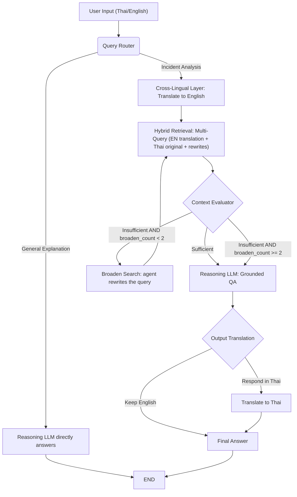

# CyberCase Intelligence Framework: Agentic RAG Pipeline

This document details the end-to-end process of the **LangGraph Agentic RAG Pipeline**, built to interpret cybersecurity incidents using the MITRE ATT&CK knowledge base. The system features a cross-lingual architecture, hybrid (Vector + Graph) retrieval, and a self-reflective agentic loop that rewrites its own queries to progressively enrich retrieval.

> [!NOTE]
> The interactive **follow-up module** (pause → ask the user → `resume`) was removed on 2026-07-28; interactive clarification is now owned by the Backend case-analysis workflow. This pipeline always runs to completion in a single call. See `rag_service/docs/FOLLOWUP_REMOVAL.md`.

---

## High-Level Workflow

The RAG pipeline operates as a stateful graph (implemented via LangGraph). The execution flow follows these primary stages:

---

## 1. Input & Routing (`router.py`)

When a user submits a query, it is first evaluated by the **QueryRouter**.
* **GENERAL_EXPLANATION**: If the query asks for definitions or concepts (e.g., "What is SQL Injection?"), it bypasses retrieval and routes directly to the LLM to answer using general knowledge.
* **INCIDENT_ANALYSIS**: If the query describes an attack sequence, forensic log, or incident, it routes into the main RAG retrieval pipeline.

## 2. Cross-Lingual Translation (`cross_lingual.py`)

To ensure maximum accuracy against the English-based MITRE ATT&CK database, the **CrossLingualLayer** translates the user's query into English.
* It explicitly preserves all technical identifiers (e.g., T1566, APT29, Phishing).
* If the user asks the query in English initially, this step is skipped.
* The system notes the original language so it can translate the final output back to the user's preferred language at the very end.

### Dual-Query Retrieval (`DUAL_QUERY_RETRIEVAL`)

Translate-then-retrieve alone (tRAG) makes the translation a single point of failure: one bad translation poisons both retrieval channels and every downstream rewrite (cf. [arXiv:2504.03616](https://arxiv.org/abs/2504.03616)). When the query is Thai, `build_retrieval_queries()` therefore issues **both** queries in parallel:

1. The English translation (always first — the evaluator and rewrites key off it).
2. The original Thai query — BGE-M3's cross-lingual dense space matches Thai→English semantically, and English keywords embedded in the Thai text (e.g., "Phishing", "T1566") still hit the sparse index exactly.

Results are merged and deduplicated by `retrieve_multi()` (highest reranker score per STIX ID wins). The flag defaults to on; set the env var `DUAL_QUERY_RETRIEVAL=false` to fall back to pure tRAG. Benchmark the two with `evaluation/crosslingual_benchmark.py`.

## 3. Hybrid Retrieval (`hybrid_retriever.py`)

Retrieval is performed against **all accumulated queries** (original query + decomposed sub-queries + all `BROADEN_SEARCH` rewrites) simultaneously, merging and deduplicating results.

1. **Vector Search**: Each query is embedded using BGE-M3 (a hybrid dense/sparse embedding model) and used to query Qdrant independently.
2. **Graph Expansion**: The system extracts STIX IDs from all vector matches and queries a Neo4j Graph Database. It retrieves subgraphs up to 2 hops away, pulling in related Mitigations, Sub-techniques, and Threat Actors.
3. **Context Assembly**: The `context_builder.py` merges and deduplicates all retrieved documents from every query, then formats them into a single structured context string for the LLM.

## 4. Context Evaluation & Self-Reflection Loop (`evaluator.py`)

Instead of blindly passing retrieved context to an LLM, the **ContextEvaluator** acts as a self-reflective judge. It inspects the merged context against the user's query and returns one of two verdicts:

* **SUFFICIENT**: The context contains enough information. Proceeds to answer generation immediately.
* **INSUFFICIENT**: The context does not fully address the query. Because the pipeline cannot ask the user anything, recovery is entirely self-driven:
  1. **Broaden Search**: The evaluator must supply a `new_query` — a plain-language reformulation using parent technique names and the broader ATT&CK tactic. It is sanitized (`query_sanitizer.py`) to strip markdown and ATT&CK ID tokens before embedding.
  2. **Multi-Query Retrieval**: The rewrite is appended to `rewritten_queries` and the next retrieval pass runs **all accumulated queries in parallel**, broadening coverage with each iteration.
  3. **Give up gracefully**: If the budget is spent — or the evaluator returns no usable rewrite, so looping would retrieve the same context — the pipeline answers with the best context it has. When the evaluator chose `ACKNOWLEDGE_LIMIT`, its message is returned instead, stating what was missing.

> [!IMPORTANT]
> **Maximum Broaden Iterations: 2** (`MAX_BROADEN_RETRIES`)
> The pipeline tracks a `broaden_count` counter. After **2** rounds the evaluator short-circuits to `SUFFICIENT` without an LLM call, and the Reasoning LLM generates the best possible answer from all context accumulated so far.

### State tracked per pipeline run

| Field | Description |
|---|---|
| `original_query` | The user's raw input (never mutated) |
| `rewritten_queries` | List of all `BROADEN_SEARCH` rewrites produced so far |
| `broaden_count` | Number of broaden iterations so far (max: **2**) |
| `strategy` / `gap_warning` / `acknowledgement_message` | Fallback strategy chosen by the evaluator and its payload |
| `merged_context` | Combined, deduplicated retrieval results across all queries |

## 5. Reasoning Generation (`context_builder.py` & `agent_graph.py`)

Once the context is deemed sufficient (or the broaden budget is exhausted), the **Reasoning LLM** generates the answer.
* It uses a strict retrieval-grounded prompt, answering **only** from the provided merged context.
* It operates strictly in English, focusing on simplifying complex cybersecurity jargon into an easy-to-understand incident narrative while preserving ATT&CK IDs and technical terms.

## 6. Output Translation (`cross_lingual.py`)

If the user originally asked their question in Thai, the final English narrative is passed to a **Translation LLM**.
* This model renders the final output into natural Thai.
* It enforces a strict rule to never translate technical terms, CVEs, or ATT&CK IDs, ensuring the final forensic report is accurate and actionable for prosecutors.

