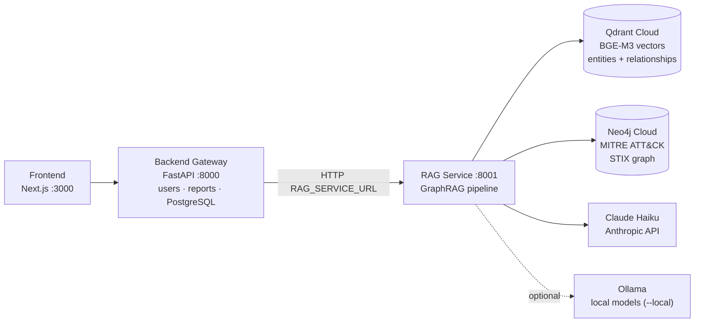
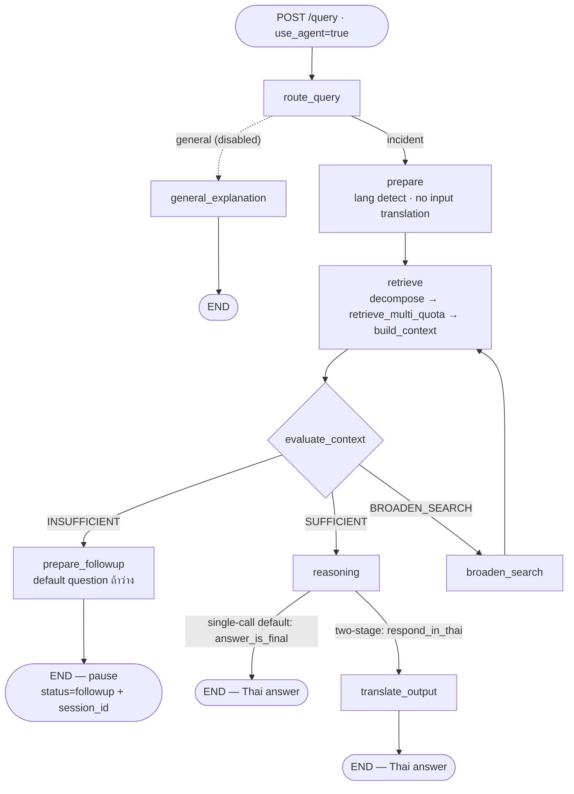
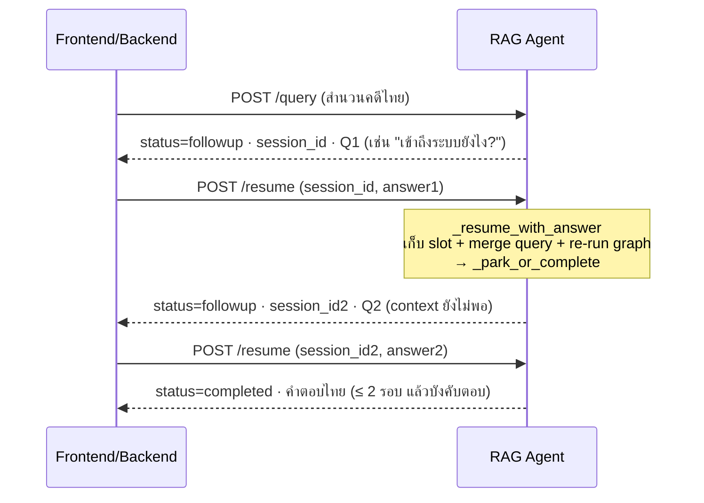
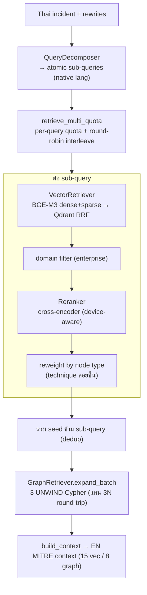
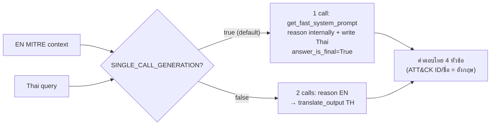
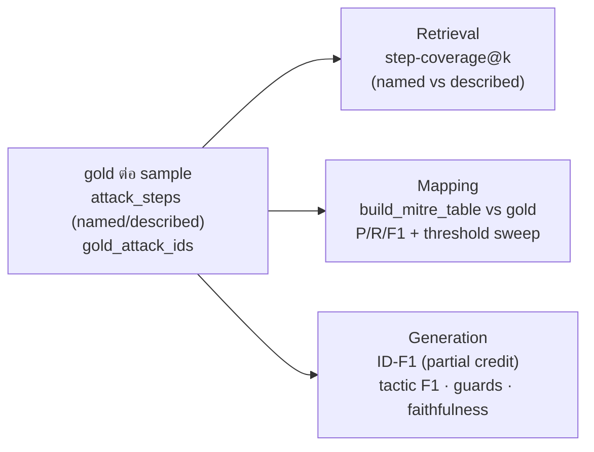

# CyberCase RAG Service — Architecture v2.0

> เอกสารนี้เขียนใหม่ทั้งหมดจากการอ่านซอร์สโค้ดปัจจุบันของ `rag_service/` (กรกฎาคม 2569)
> เน้น **สถาปัตยกรรม + diagram + design ที่เป็นปัจจุบัน** (single-call generation, multi-turn
> follow-up, batched retrieval, device-aware) — สำหรับรายละเอียดระดับ *ทุกฟังก์ชัน* ดู
> [`ARCHITECTURE.md`](../ARCHITECTURE.md) (per-function reference)

**การเปลี่ยนแปลงหลักจาก v1 → v2** (diagram v1 ยัง reflect ของเก่า):
- **Generation:** two-stage (reason EN → translate TH) → **single-call variant C** (call เดียว เขียนไทยเลย)
- **Follow-up resume:** คืน completed เสมอ → **multi-turn** (คืน followup รอบใหม่ได้)
- **Graph expansion:** วนทีละ seed (3N round-trip) → **batched** (3 UNWIND Cypher)
- **Model device:** fp16 hardcoded → **auto GPU/CPU** (fp16 เฉพาะ GPU)

---

## 1. บริบทระบบ (3 services)

`rag_service` เป็น FastAPI microservice (พอร์ต 8001) ที่โฮสต์ GraphRAG pipeline ทั้งหมด
Backend gateway เป็น proxy บางๆ ที่ forward RAG call มาที่นี่ผ่าน HTTP



**หลักภาษา (Language contract):** input เป็นสำนวนคดี**ไทย**เสมอ, output **ไทย**เสมอ;
context จาก MITRE เป็น**อังกฤษ** (ไม่แปล query ขาเข้า — BGE-M3 multilingual)

---

## 2. Tech stack & Models

| ชั้น | เทคโนโลยี | หมายเหตุ |
|---|---|---|
| API | FastAPI (lifespan โหลดโมเดล/ต่อ DB ครั้งเดียว) | `/query`, `/resume`, `/health`, `/retrieval-context/{id}` |
| Agentic engine | LangGraph `StateGraph` | node + conditional edges + in-memory session store |
| Embedding | `BAAI/bge-m3` (1024-d dense + sparse) | fp16 บน GPU / fp32 บน CPU |
| Vector DB | Qdrant Cloud (native RRF fusion) | collection: entities, relationships |
| Reranker | `BAAI/bge-reranker-v2-m3` (cross-encoder) | device-aware; คอขวด latency บน CPU |
| Graph DB | Neo4j Cloud (STIX 2.1) | Technique/Tactic/Group/Software/Campaign/Mitigation/DataComponent |
| LLM (reasoning/translation/eval) | Claude Haiku 4.5 (`LLM_MODEL`) | temp 0; local Ollama optional |

**Device selection:** `config.DEVICE` = cuda ถ้ามี GPU ไม่งั้น cpu; `USE_FP16 = (DEVICE=="cuda")`;
override `RAG_DEVICE=cpu|cuda`. **Production (Railway) = CPU** (torch CPU wheel + `python:3.11-slim`)

---

## 3. Request lifecycle — `POST /query` (agent)



- **prepare:** ตรวจว่าตอบไทยไหม, ตั้ง `english_query = query` (ไม่แปลขาเข้า)
- **retrieve:** full query เป็น channel แรก + sub-queries (decompose) + rewrites → quota retrieval
- **evaluate_context:** LLM ประเมิน context พอไหม → SUFFICIENT / INSUFFICIENT / BROADEN_SEARCH
  (self-reflection loop, bounded `MAX_FOLLOWUP_RETRIES = 2`)
- **reasoning:** *single-call (default)* — `get_fast_system_prompt` เขียนไทยเลย ตั้ง `answer_is_final=True`
  → ข้าม translate_output; *two-stage* (`SINGLE_CALL_GENERATION=false`) — reason EN แล้ว translate_output → TH

---

## 4. Multi-turn follow-up — `POST /resume`

เมื่อ context ไม่พอ agent หยุดถาม follow-up (status=followup + session_id เก็บใน `_sessions`)
Frontend ส่งคำตอบกลับผ่าน `/resume` — **อาจถูกถามซ้ำได้หลายรอบ** (แก้ v2: `_park_or_complete`)



> ⚠️ **Integration:** caller (backend proxy + frontend) ต้อง **loop `/resume` จนกว่า `status=="completed"`**
> ไม่ใช่สมมติว่า resume จบเสมอ — ยังไม่ได้ verify ฝั่ง backend/frontend (งานค้าง)

---

## 5. Retrieval subsystem



**Per-query quota** เก็บ top-k ของแต่ละ sub-query แล้ว round-robin → ทุก technique มีที่ใน context
(กัน final top-K ตัดทั้ง technique) · **batched expand** ลด Neo4j round-trip 3.5× (behavior-preserving)

---

## 6. Generation (single-call variant C)



**หลักฐาน (benchmark 45 sample):** single-call ≈ two-stage (ID-F1 Δ−0.011, CI คร่อม 0) แต่ latency ครึ่งเดียว,
token −44%; ชั้นแปลไม่เคยทำ ATT&CK ID หาย (id_survival = 1.0). 4 หัวข้อ: สรุปเหตุการณ์ / ลำดับการโจมตี /
เทคนิคที่ตรวจพบ / ผลกระทบ

---

## 7. Mapping — ตาราง MITRE ส่ง backend

`pipeline/mitre_table.build_mitre_table(rag_result, answer)` แปลง raw retrieval → ตาราง technique
ที่กรอง noise 2 ชั้น:
1. **Answer-grounded:** เก็บ entity ที่ ID/ชื่อโผล่ในคำตอบ (LLM เลือกให้ฟรี)
2. **Score threshold:** ตัด vector hit ที่ไม่ถูกอ้าง + คะแนน rerank ต่ำ; ทิ้ง graph neighbor ที่ไม่ถูกอ้าง

ผล eval: raw retrieval ~64 ID/ข้อ (precision 0.08) → ตารางกรอง ~8 ID/ข้อ (precision 0.40)

---

## 8. Evaluation pipeline (3 ชั้นบน gold เดียวกัน)



**Harness:** `crosslingual_generation_benchmark.py` — เทียบ 5 variant (A baseline / B +MT query /
C single-call / D Haiku translator / E EN ceiling) บน **frozen context**, 3 เฟส resumable
(`retrieve` / `generate` / `score` + `score-mapping` + `score-retrieval`), paired bootstrap CI + Wilcoxon

**Dataset:** สำนวนคดีไทยเรียงเวลา — 45 group-sourced + 20 campaign-sourced (เหตุการณ์จริง เช่น SolarWinds
C0024, Operation Dream Job C0022) สร้างโดย `make_incident_dataset.py` (kill-chain + named/described cue);
lookup dataset เดิมโดย `generate_eval_dataset.py` (graph = ground truth)

---

## 9. Configuration & Deployment

| หมวด | ค่า/ตัวแปร |
|---|---|
| Generation | `SINGLE_CALL_GENERATION=true` (default) |
| Device | `DEVICE` (auto), `USE_FP16=(cuda)`, override `RAG_DEVICE=cpu\|cuda` |
| Retrieval | `VECTOR_TOP_K=10`, `FINAL_TOP_K=5`, `GRAPH_EXPANSION_DEPTH=2`, `ATTACK_DOMAIN_FILTER=enterprise` |
| LLM | `LLM_MODEL=claude-haiku-4-5`, `LLM_TEMPERATURE=0` |
| Follow-up | `MAX_FOLLOWUP_RETRIES=2` |
| Deploy | Docker (`python:3.11-slim`, torch CPU wheel) → **Railway = CPU inference** |

**คอขวด latency บน production (CPU):** cross-encoder reranker (~7-8s/sub-query) — batch ไม่ช่วย
(พิสูจน์แล้ว); งานปรับปรุงคนละก้อน (ลด sub-query / reranker เล็กลง / GPU host)

---

## 10. โครงสร้างไดเรกทอรี (rag_service/app/RAG/GraphRAG)

```
config.py                 # DEVICE/USE_FP16, SINGLE_CALL_GENERATION, model/DB settings
pipeline/
  agent_graph.py          # LangGraph state machine (query/resume, _park_or_complete)
  chain.py                # linear LCEL (legacy, two-stage; ใช้ใน eval generation)
  cross_lingual.py        # prompts: reasoning / translation / fast / ultrafast
  context_builder.py      # build_context, build_generation_prompt
  evaluator.py            # context sufficiency + slot-aware follow-up
  query_decomposer.py     # incident → atomic sub-queries
  query_merger.py         # merge follow-up answer → MITRE-aligned rewrite
  mitre_table.py          # answer-grounded MITRE mapping table
  router.py               # general vs incident (ปิดชั่วคราว)
retrieval/
  hybrid_retriever.py     # retrieve / retrieve_multi / retrieve_multi_quota
  vector_retriever.py     # BGE-M3 + Qdrant hybrid RRF
  reranker.py             # cross-encoder (device-aware)
  graph_retriever.py      # expand_batch (batched Neo4j)
ingestion/                # STIX parse → Neo4j + Qdrant
evaluation/               # metrics, benchmark harness, dataset builders (ดู §8)
```

---

## 11. อ้างอิงเพิ่มเติม
- [`ARCHITECTURE.md`](../ARCHITECTURE.md) — per-function reference ทุกไฟล์ (รายละเอียดระดับฟังก์ชัน)
- [`docs/retrieval_perf_optimization.md`](retrieval_perf_optimization.md) — งาน batched expand + device (CPU/GPU)
- `evaluation/results/` — รายงาน benchmark (generation / mapping / retrieval)
