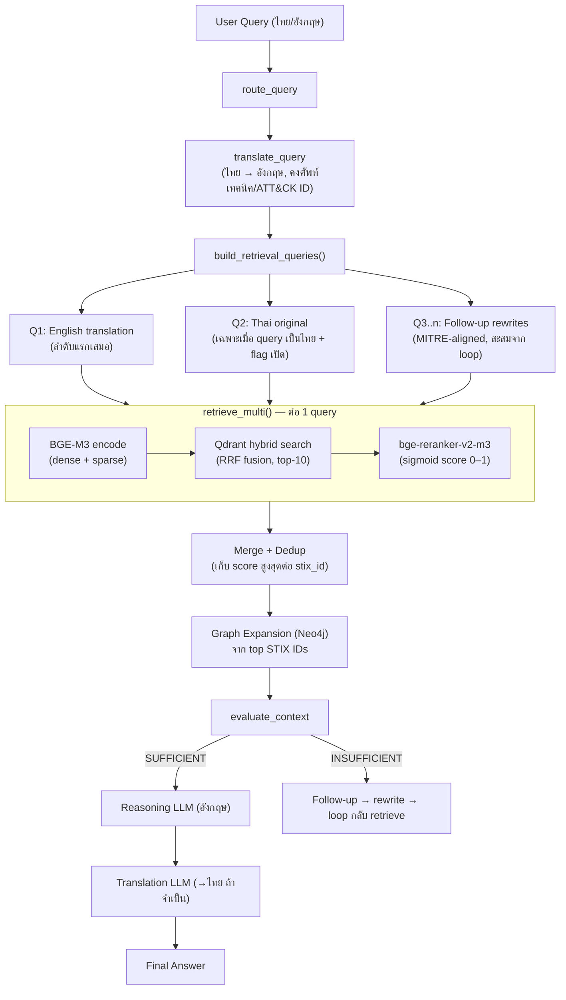

# Cross-Lingual Retrieval Upgrade — tRAG → Dual-Query

เอกสารฉบับนี้สรุป **การเปลี่ยนแปลงสถาปัตยกรรม retrieval ของ RAG Module** จากแบบ
*translate-then-retrieve* (tRAG) ไปเป็น **Dual-Query Retrieval** พร้อมการเปลี่ยน reranker
และเครื่องมือ benchmark ใหม่สำหรับวัดผลเชิงตัวเลข

> เอกสารอ้างอิงโค้ดจริง ณ มิถุนายน 2026 (branch `feat/finetune-mitre-specialist`)
> เอกสารหลักของทั้งโมดูลดู [RAG_Module.md](RAG_Module.md)

---

## สารบัญ

1. [ทำไมต้องเปลี่ยน (Motivation)](#1-ทำไมต้องเปลี่ยน-motivation)
2. [สรุปการเปลี่ยนแปลง (What Changed)](#2-สรุปการเปลี่ยนแปลง-what-changed)
3. [Architecture ปัจจุบัน](#3-architecture-ปัจจุบัน)
4. [Reranker ใหม่ — bge-reranker-v2-m3](#4-reranker-ใหม่--bge-reranker-v2-m3)
5. [Benchmark — crosslingual_benchmark.py](#5-benchmark--crosslingual_benchmarkpy)
6. [การ Rollback](#6-การ-rollback)
7. [สถานะการตรวจสอบ & งานค้าง](#7-สถานะการตรวจสอบ--งานค้าง)

---

## 1. ทำไมต้องเปลี่ยน (Motivation)

### 1.1 ปัญหาของ tRAG (translate-then-retrieve)

Flow เดิมของระบบคือแปลคำถามภาษาไทยเป็นอังกฤษด้วย LLM ก่อน แล้วค่อย retrieve
ด้วยคำแปล**เพียงอย่างเดียว** — งานวิจัยเรียกแนวทางนี้ว่า **tRAG** และชี้ว่าเป็นแนวทางที่เปราะบาง:

- **Ranaldi et al. 2025** ([arXiv:2504.03616](https://arxiv.org/abs/2504.03616)) — เทียบ tRAG /
  MultiRAG / CrossRAG พบว่า tRAG "suffers from limited coverage" เพราะคุณภาพการแปล
  ส่งผลตรงต่อ retrieval
- **XRAG benchmark** ([arXiv:2505.10089](https://arxiv.org/abs/2505.10089), Amazon) — พบว่าใน
  cross-lingual RAG ปัญหาหลักอยู่ที่การ reasoning ข้ามภาษาตอน generation ซึ่ง pipeline
  ของเราจัดการถูกแล้ว (reason เป็นอังกฤษ → แปลผลลัพธ์เป็นไทยตอนจบ) — จุดเสี่ยงที่เหลือ
  จึงอยู่ที่ฝั่ง retrieval ล้วน ๆ

### 1.2 จุดอ่อนที่พบในโค้ดเดิม

| # | จุดอ่อน | ผลกระทบ |
|---|---------|----------|
| 1 | คำแปลจาก LLM เป็น **single point of failure** | แปลพลาดครั้งเดียว → dense, sparse, reranker, evaluator และ follow-up rewrite ทุกตัวพังตาม เพราะทุกอย่าง key จาก `english_query` |
| 2 | Query ไทยล้วนเข้า sparse index ไม่ได้ | lexical weights ของ BGE-M3 เป็น token-level — token ไทยไม่ match เอกสารอังกฤษ (ยกเว้นคีย์เวิร์ดอังกฤษที่ฝังในคำถาม เช่น `T1566`, `Phishing`) |
| 3 | Reranker เดิม (`mmarco-mMiniLMv2`) **ไม่รองรับภาษาไทย** | เทรนบน mMARCO 14 ภาษา ซึ่งไม่มีไทย — คู่ (Thai query, English doc) เป็น out-of-distribution |
| 4 | Endpoint `/generate-report` ยิง **query ดิบ** เข้า retrieval | ไม่ผ่านการแปลเลย — แย่กว่า tRAG อีกขั้น สำหรับคำถามภาษาไทย |

### 1.3 ทำไม Dual-Query ตอบโจทย์

BGE-M3 (embedding ที่ใช้อยู่แล้ว) เป็นโมเดล multilingual ที่ dense space ถูก align
ข้ามภาษา — query ไทยค้นเอกสารอังกฤษเชิงความหมายได้โดยตรง ดังนั้นแทนที่จะ*เลือก*ระหว่าง
แปลหรือไม่แปล เรายิง**ทั้งสอง query ขนานกัน**แล้ว fuse ผล:

- คำแปลถูก → ช่องอังกฤษทำงานเต็มประสิทธิภาพเหมือนเดิม
- คำแปลพลาด → ช่องไทย (dense) + คีย์เวิร์ดอังกฤษในคำถามไทย (sparse) กู้สถานการณ์
- โครงสร้างเดิมรองรับอยู่แล้ว — `retrieve_multi()` ถูกสร้างไว้สำหรับ multi-query
  (follow-up rewrites) การเพิ่มอีกหนึ่ง query channel จึงแทบไม่มีต้นทุนเชิงโค้ด

---

## 2. สรุปการเปลี่ยนแปลง (What Changed)

### 2.1 ไฟล์ที่แก้

| ไฟล์ | การเปลี่ยนแปลง |
|------|----------------|
| `GraphRAG/config.py` | เพิ่ม flag `DUAL_QUERY_RETRIEVAL` (env, default `true`); เปลี่ยน `RERANKER_MODEL` → `BAAI/bge-reranker-v2-m3` (ตัวเดิม comment ไว้ rollback ได้) |
| `pipeline/cross_lingual.py` | เพิ่มฟังก์ชัน **`build_retrieval_queries(original, english, extra)`** — จุดเดียวที่กำหนดนโยบาย dual-query ทุก path เรียกผ่านตัวนี้ |
| `pipeline/agent_graph.py` | `_node_retrieve` และ `retrieve_only()` สร้าง query list ผ่าน `build_retrieval_queries` |
| `pipeline/chain.py` | `query()` step 2 และ `retrieve_only()` เปลี่ยนจาก `retrieve(english)` → `retrieve_multi(queries)` |
| `app/main.py` | `/generate-report` แปลคำถามก่อน (เดิมไม่แปลเลย) แล้ว retrieve แบบ dual-query |
| `evaluation/eval_runner.py` | `_make_generation_fn` ใช้ flow เดียวกับ chain เพื่อให้ RAGAS เห็น context ตรงกับ runtime จริง |
| `__init__.py` ทั้ง 3 ชั้น | export `build_retrieval_queries` ขึ้นถึงระดับ `RAG` package |
| `evaluation/crosslingual_benchmark.py` | **ไฟล์ใหม่** — benchmark เทียบ tRAG / Thai-direct / Dual-query (ดู [§5](#5-benchmark--crosslingual_benchmarkpy)) |
| `Architecture.md`, `pipeline.md`, `CLAUDE.md`, `RAG_Module.md` | อัปเดตให้ตรง flow ใหม่ |

### 2.2 พฤติกรรมที่เปลี่ยน (Before → After)

| มุมมอง | เดิม (tRAG) | ใหม่ (Dual-Query) |
|--------|-------------|-------------------|
| Query ไทย | แปล → retrieve ด้วยคำแปล 1 query | แปล → retrieve ด้วย **[คำแปล, ไทยต้นฉบับ]** 2 query ขนาน → fuse |
| Query อังกฤษ | retrieve ตรง 1 query | **เหมือนเดิมทุกประการ** (ไม่เบิ้ล query) |
| Follow-up rewrites | ต่อท้าย query list | เหมือนเดิม — ต่อท้ายหลังสอง query แรก (dedup ให้) |
| Reranker | mmarco-mMiniLMv2 (117M, ไม่มีไทย) | bge-reranker-v2-m3 (568M, multilingual รวมไทย) |
| `/generate-report` | query ดิบ ไม่แปล | แปล + dual-query เหมือน path อื่น |
| จำนวน LLM call | เท่าเดิม | **เท่าเดิม** (การแปลยังเกิด 1 ครั้งเหมือนเดิม — เพิ่มเฉพาะงาน vector search + rerank อีก 1 รอบสำหรับ query ไทย) |

---

## 3. Architecture ปัจจุบัน

### 3.1 Flow รวม (โหมด Agent)



### 3.2 กติกาของ `build_retrieval_queries()`

อยู่ใน `pipeline/cross_lingual.py` — เป็น pure function จุดเดียวที่ทุก path
(agent / chain / report / eval) ใช้ร่วมกัน:

1. **คำแปลอังกฤษมาก่อนเสมอ** — เพราะ `evaluator`, `QueryMerger` และ follow-up rewrites
   ทั้งหมด key จาก `english_query` flow ภาษาอังกฤษฝั่ง reasoning ไม่เปลี่ยน
2. **เพิ่ม Thai ต้นฉบับเป็น query ที่สอง** เฉพาะเมื่อ: flag `DUAL_QUERY_RETRIEVAL` เปิด
   **และ** query มีอักขระไทย **และ** ต้นฉบับไม่เหมือนคำแปล (กันเบิ้ล query อังกฤษ)
3. **rewrites ต่อท้าย** พร้อม dedup — query ซ้ำไม่ถูกยิงซ้ำ

ผลจากแต่ละ query ถูก merge ใน `HybridRetriever.retrieve_multi()` โดยเก็บ **score
สูงสุดต่อ STIX ID** — เทียบกันได้ตรง ๆ เพราะทุก query ใช้ reranker ตัวเดียวกัน
(sigmoid → [0,1])

### 3.3 จุดที่ dual-query ถูก wire เข้า

| Path | จุดเรียก | หมายเหตุ |
|------|----------|----------|
| Agent (`/query` use_agent=true) | `_node_retrieve` | รวม follow-up rewrites ทุกรอบ loop |
| Agent debug | `retrieve_only()` | CLI `--retrieve-only --agent` |
| Chain (`/query` use_agent=false) | `query()` step 2 | |
| Chain debug | `retrieve_only()` | CLI `--retrieve-only` |
| Report (`/generate-report`) | `app/main.py` | เดิมไม่แปลเลย — แก้พร้อมกัน |
| Evaluation (RAGAS) | `eval_runner._make_generation_fn` | ให้ context ที่วัดตรงกับ runtime |

---

## 4. Reranker ใหม่ — bge-reranker-v2-m3

| | เดิม | ใหม่ |
|---|------|------|
| โมเดล | `cross-encoder/mmarco-mMiniLMv2-L12-H384-v1` | `BAAI/bge-reranker-v2-m3` |
| ขนาด | ~117M params | ~568M params (~5 เท่า) |
| ภาษาไทย | ❌ ไม่มีใน mMARCO 14 ภาษา | ✅ multilingual (backbone เดียวกับ BGE-M3) |
| Interface | `CrossEncoder` (sentence-transformers) | เหมือนเดิม — ไม่ต้องแก้โค้ด `reranker.py` |

**ทำไมต้องเปลี่ยนพร้อมกัน:** ใน dual-query ช่อง Thai ต้องถูก rerank ด้วยคู่
(Thai query, English doc) — ถ้าใช้ mmarco ตัวเดิมซึ่งไม่รู้จักภาษาไทย คะแนนช่อง Thai
จะมั่ว แล้วผล fuse จะถูกช่องอังกฤษกดทับ ทำให้ dual-query ไร้ความหมาย

**ผลทดสอบ (smoke test จริงบนเครื่อง):** คู่ Thai query ↔ English doc ที่เกี่ยวข้อง
ได้ 0.676 ส่วนคู่ที่ไม่เกี่ยวได้ 0.500 — แยกแยะข้ามภาษาได้ถูกต้อง

**Tradeoff:** โมเดลใหญ่ขึ้น ~5 เท่า → latency ขั้น rerank เพิ่มขึ้นชัดเจนโดยเฉพาะบน CPU
ตัวเลขจริงดูจากคอลัมน์ Latency ของ benchmark — ถ้ารับไม่ได้ดู [§6](#6-การ-rollback)

---

## 5. Benchmark — `crosslingual_benchmark.py`

ไฟล์ใหม่ใน `evaluation/` สำหรับตอบคำถามเชิงตัวเลขว่า **dual-query ดีกว่า tRAG จริงไหม
และ BGE-M3 ค้นข้ามภาษาตรง ๆ ได้ดีแค่ไหน**

### 5.1 สามคอนฟิกที่เทียบ

| Config | Query ที่ใช้ retrieve | แทน |
|--------|----------------------|-----|
| `tRAG` | คำแปลอังกฤษอย่างเดียว | พฤติกรรมเดิมของระบบ |
| `Thai-direct` | ไทยต้นฉบับอย่างเดียว | ขีดความสามารถ cross-lingual ของ BGE-M3 ล้วน |
| `Dual-query` | ทั้งสอง fuse กัน | พฤติกรรมใหม่ |

### 5.2 วิธีรัน

```powershell
cd rag_service\app\RAG\GraphRAG
# ต้องมี QDRANT_URL/QDRANT_API_KEY + ANTHROPIC_API_KEY ใน env

# รอบเล็กก่อน (50 ข้อ)
python -m evaluation.crosslingual_benchmark --max-samples 50

# รันเต็ม 371 ข้อ + เก็บผลลงไฟล์
python -m evaluation.crosslingual_benchmark --output results_xling.md

# รวม graph expansion ด้วย (ช้ากว่า)
python -m evaluation.crosslingual_benchmark --with-graph
```

### 5.3 รายละเอียดสำคัญ

- **Dataset:** `Thai_dataset.json` กรองเฉพาะ `language == "th"` (371 ข้อ มี
  `relevant_stix_ids` เป็น ground truth จาก Neo4j)
- **เมตริก:** Hit@K, Recall@K, Precision@K, NDCG@K (K=1,3,5,10), MRR, MAP, latency
  — ใช้ `retriever_metrics.py` ชุดเดียวกับ `eval_runner`
- **Translation cache:** คำแปลถูก cache ลง `evaluation/translation_cache.json`
  → ทุกคอนฟิกเห็นคำแปลเดียวกัน, รันซ้ำไม่เสียค่า LLM, checkpoint ทุก 10 ข้อ
- **Default วัดเฉพาะ vector + rerank** (ส่วนที่ภาษามีผล) — `--with-graph` ถ้าต้องการวัด
  pipeline เต็ม
- Latency ที่รายงาน**ไม่รวม**การเรียก LLM แปล (pre-computed) — ใน production
  tRAG/Dual-query มี overhead แปล 1 ครั้งที่ Thai-direct ไม่มี

### 5.4 วิธีอ่านผล

- `Dual-query ≥ tRAG` ทุกเมตริก → ยืนยันว่า dual-query คุ้ม (คาดหวังตามทฤษฎี
  เพราะเป็น superset ของ tRAG)
- `Thai-direct` ใกล้ `tRAG` → BGE-M3 แบกข้ามภาษาไหว แปลว่าระบบทนคำแปลพลาดได้ดี
- `Thai-direct` ต่ำกว่ามาก → การแปลยังจำเป็น ห้ามตัดออก (dual-query ยังคุ้มอยู่ดี
  ในฐานะ safety net)

---

## 6. การ Rollback

ออกแบบให้ถอยได้สองจุดอิสระต่อกัน โดยไม่ต้องแก้โค้ด:

| ต้องการถอย | วิธี |
|------------|------|
| ปิด dual-query (กลับเป็น tRAG เดิม) | ตั้ง env `DUAL_QUERY_RETRIEVAL=false` |
| กลับไปใช้ reranker ตัวเดิม | สลับ comment `RERANKER_MODEL` ใน `config.py` (ตัวเดิม comment ไว้ให้แล้ว) |

> ข้อควรระวัง: ถ้าเปิด dual-query แต่ถอย reranker เป็น mmarco — ช่อง Thai จะถูก rerank
> ด้วยโมเดลที่ไม่รู้จักภาษาไทย ควรถอยทั้งคู่หรือไม่ถอยเลย

---

## 7. สถานะการตรวจสอบ & งานค้าง

### ตรวจแล้ว ✅

- Compile + import ผ่านทุกไฟล์ (รวม export chain 3 ชั้นถึง `RAG` package)
- Unit test `build_retrieval_queries` ผ่าน 4 เคส: ไทย+แปล / อังกฤษล้วน (ไม่เบิ้ล) /
  rewrites dedup / query ไทยปนอังกฤษ
- Smoke test reranker ใหม่กับคู่ Thai↔English จริง — แยกแยะ relevant/irrelevant ถูกต้อง
- โมเดล `bge-reranker-v2-m3` อยู่ใน HuggingFace cache ของเครื่องแล้ว (ไม่ต้องโหลดใหม่)

### ยังค้าง ⏳

- **รัน `crosslingual_benchmark.py` กับ Qdrant จริง** — ตอน implement ไม่มี Qdrant
  ให้ต่อ (Docker ปิด / Doppler ไม่อยู่บน PATH) ตัวเลข Recall/MRR เปรียบเทียบ 3 คอนฟิก
  จึงยังไม่มี — ควรรันก่อน merge เข้า main
- วัด latency จริงของ reranker ใหม่บนเครื่อง production (CPU vs GPU)
- อัปเดตผลใน `results.md` หลังรัน benchmark
